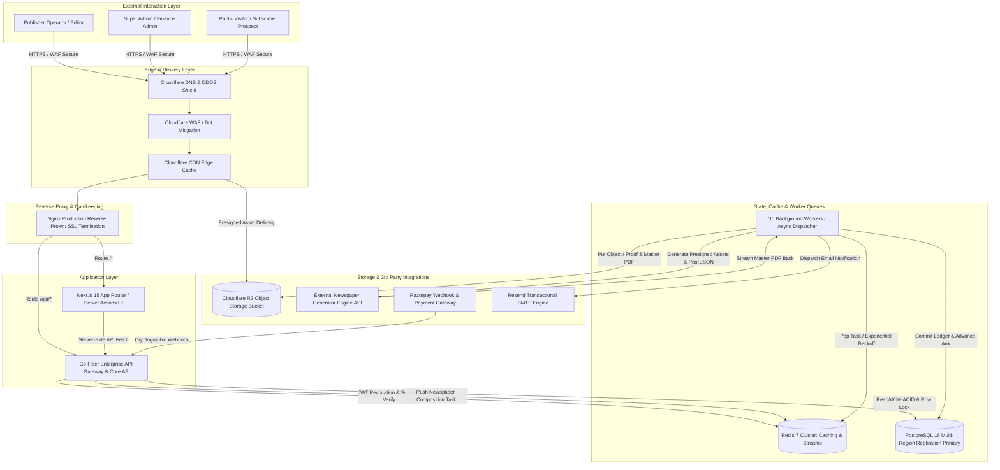
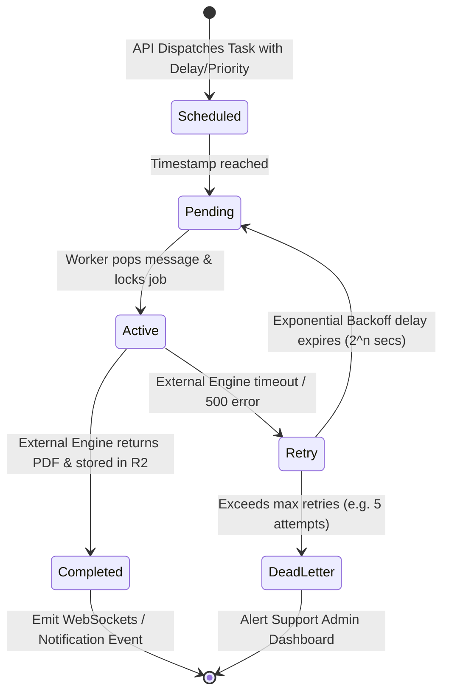
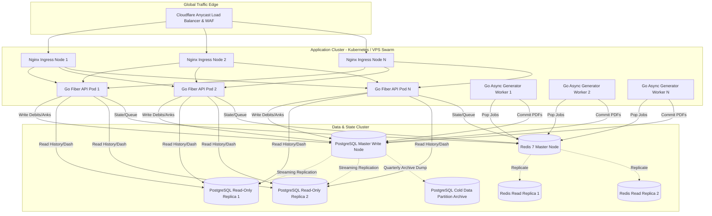

# Volume 1: Enterprise System Architecture & Cloud Infrastructure Strategy

**Project:** Newspaper Automatic Composition SaaS Platform  
**Target Audience:** Enterprise Architecture Review Board, DevOps Engineers, Backend Engineers  
**Deliverables Covered:** 1. Enterprise System Architecture, 15. Redis Strategy, 16. Queue Architecture, 17. Background Worker Architecture, 18. Cloud Storage Architecture, 34. Scaling Strategy (1 Million Users)

---

## 1. Enterprise System Architecture (Deliverable #1)

### 1.1 Architectural Philosophy & Core Tenets
The **Newspaper Automatic Composition SaaS Platform** is architected as an decoupled, modular, zero-trust cloud-native application. It strictly isolates financial accounting (wallet ledgers), authentication security, and high-load newspaper document synthesis into distinct operational zones.

#### Key Design Tenets:
1. **Zero Client Trust:** Web browsers and external webhooks (Razorpay) are treated as hostile environments. All input verification, pricing calculations, issue numbering (Ank), and wallet deductions occur solely within secure backend transactions.
2. **Strict Concurrency Isolation:** Financial ledgers and sequential issue numbering employ ACID-compliant database locking mechanisms to eliminate double-spend vulnerabilities or conflicting daily edition numbers.
3. **Asynchronous Non-Blocking IO:** Newspaper PDF composition relies on heavy graphics processing by an external engine. To protect backend server throughput, all newspaper composition calls are converted into lightweight distributed tasks managed via Redis Queues and background Go Fiber workers.
4. **Zero-Egress Storage Hierarchy:** High-resolution CMYK and RGB PDF files are stored on Cloudflare R2 (S3-compatible object storage) with edge-cached presigned download URLs, completely eliminating traditional data transfer egress costs.

### 1.2 Comprehensive High-Level Systems Blueprint



---

## 2. Redis Strategy & Caching Layer (Deliverable #15)

Redis 7 operates as the high-performance in-memory backbone for four mission-critical subsystems: Session Revocation, Rate Limiting, Reference Data Caching, and Task Queue Orchestration.

### 2.1 Cache Topology & Namespaces
To avoid collisions across multiple micro-workspaces or environments, all Redis keys conform to strict hierarchical namespaces separated by colons (`:`).

| Namespace | Example Key | TTL | Purpose | Data Structure |
| :--- | :--- | :--- | :--- | :--- |
| `sess` | `sess:refresh:<token_uuid>` | 7 Days | Tracks authorized refresh tokens; deleted upon logout or admin ban. | `STRING` (Value: UserID) |
| `ban` | `ban:usr:<user_id>` | 24 Hours | Instant blacklisting flag for compromised or suspended accounts. | `STRING` (Value: Timestamp) |
| `rate` | `rate:api:<ip_address>` | 60 Sec | Sliding window counter for endpoints to prevent DDoS attacks. | `ZSET` (Sorted Set timestamps) |
| `news` | `news:settings:<newspaper_id>` | 30 Mins | Cached publishing preferences (headers, margins, fonts, RNI). | `HASH` |
| `issue`| `issue:lock:<newspaper_id>:<date>`| 10 Mins | Distributed mutex lock to prevent concurrent daily Ank races. | `STRING` (PX EXCLUSIVE) |

### 2.2 Redis vs. In-Memory Go Map Alternatives
* **Why Redis is Superior:** While native Go sync.Maps offer microsecond memory lookup speeds, they remain localized to a single application instance. When our SaaS platform scales out horizontally across multiple Docker VPS containers or Kubernetes pods, a user banned on Server A could continue generating expensive PDFs on Server B if local maps were utilized. Redis guarantees instantaneous cluster-wide consistency for session invalidation and wallet freeze states.

---

## 3. Queue Architecture & Reliability Engineering (Deliverable #16)

Newspaper layout synthesis requires computationally heavy typography resolution, PDF vectorization, and CMYK color space conversions by the external engine. Handling this synchronously inside an HTTP request would trigger gateway timeouts and lock server threads.

### 3.1 Task Lifecycle & Asynq Architecture
We utilize **Asynq** (built over Redis Streams and Sorted Sets) for fault-tolerant background message brokering.



### 3.2 Queue Separation & Prioritization
To prevent long queues of routine bulk weekly publications from delaying real-time breaking daily news generation, we isolate task processing into designated queues:

1. **`critical` (Weight: 60%):** Immediate interactive newspaper generation triggered directly by logged-in publishers.
2. **`default` (Weight: 30%):** Webhook verifications, ledger receipt invoicing, and subscription processing.
3. **`low` (Weight: 10%):** Nightly analytical aggregations, PDF history cleanup, and monthly RNI usage reports.

---

## 4. Background Worker Architecture (Deliverable #17)

The worker fleet operates as autonomous Go Fiber background daemons that decouple external processing risk from our core user-facing web dashboard.

### 4.1 Resilient Execution & Fallback Protocols
When a worker picks up a `TaskGenerateNewspaper`, it executes a disciplined sequence designed to prevent financial loss or corrupt database states:

1. **Idempotency Check:** Verify if `generation_history` already records a successful PDF output for this unique operational tracking ID. If positive, skip external API dispatch to save processing resources.
2. **Two-Phase Wallet Reservation Verification:** Verify that the required funds (e.g., ₹100 per edition) are in a `PENDING_DEBIT` state in the `wallet_ledgers` table.
3. **Asset Gathering & Presigned Linking:** Read user profile logo and newspaper headers. Rather than downloading heavy image files and piping them over HTTP multipart arrays, generate 15-minute secure read-only presigned R2 URLs.
4. **External Engine Invocation:** Transmit clean JSON configuration payload with strict **45-second read/write HTTP timeouts**.
5. **Commit Phase:** Upon receiving the byte stream from the generator:
   - Stream upload to Cloudflare R2 bucket (`/newspapers/yyyy/mm/dd/ank_125_newspaper.pdf`).
   - Execute PostgreSQL atomic transaction: set `generation_history.status = 'SUCCESS'`, transition wallet ledger from `PENDING_DEBIT` to `COMMITTED_DEBIT`, and advance `newspapers.default_issue_number` by `+1`.
6. **Rollback Phase (In case of Generator Failure):** If external generation fails after 4 exponential retry attempts, the worker initiates automated financial rollback:
   - Mark `generation_history.status = 'FAILED'`.
   - Update wallet ledger from `PENDING_DEBIT` to `REFUNDED_AUTOMATION_FAILURE`.
   - Send priority alert email to publisher and admin log via Resend API.

---

## 5. Cloud Storage Architecture: Cloudflare R2 (Deliverable #18)

Newspaper publishing portals face massive storage bandwidth costs if built on legacy AWS S3 environments due to daily repetitive downloads of print-ready production PDFs (ranging from 15MB to 80MB each) by press operations, editors, and regional circulation teams.

### 5.1 Storage Hierarchy & Naming Convention
We deploy Cloudflare R2 configured with custom domain CNAME routing (`cdn.newspaper-erp.com`), providing robust encryption at rest and zero egress billing.

```
cloudflare-r2-bucket: enterprise-newspaper-portal/
├── tenant_assets/
│   └── org_{organization_id}/
│       ├── logo_primary_{timestamp}.png
│       ├── front_page_header_{timestamp}.png
│       ├── inner_page_header_{timestamp}.png
│       ├── official_stamp_{timestamp}.png
│       └── digital_signature_{timestamp}.png
├── publications/
│   └── org_{organization_id}/
│       └── {year}/
│           └── {month}/
│               └── issue_{ank_number}_{date}_{uuid}.pdf
└── invoices/
    └── rzp_inv_{payment_id}.pdf
```

### 5.2 Security & Presigned Access Architecture
To prevent public web scraping or unauthorized distribution of proprietary news editions:
- The R2 Bucket is configured as strictly **Private No-Public-List**.
- When a user presses "Download PDF" or "Preview" on the client UI, Next.js calls `/api/v1/pdf/download/{id}`.
- The Go Fiber backend validates JWT authorization, verifies user-to-newspaper alignment, and invokes the AWS/R2 Go V2 SDK to forge a temporary **Presigned GetObject URL** expiring in 60 minutes.
- The browser downloads directly from Cloudflare edge nodes without proxying gigabytes of data through our backend application server RAM.

---

## 6. Scaling Strategy: Supporting 1 Million Users (Deliverable #34)

As the SaaS platform expands to support national media houses and syndicates totaling over 1,000,000 publishers and reporters, architectural bottlenecks are mitigated via database horizontal sharding, stateless compute scalability, and geographic Edge CDN routing.

### 6.1 Horizontal Sharding & Read/Write Replication
1. **Database Read Replicas (Pgpool-II / Patroni):** 
   - 90% of dashboard database hits are read-intensive (e.g., viewing ledger histories, querying previous issue counts, validating session profiles).
   - We separate PostgreSQL traffic: **Master Node** accepts exclusively ledger debits, issue increments, and profile edits. A pool of **Read Replicas** handles all analytical reporting, pagination, and search queries.
2. **Tenant Tenant-Group Partitioning:** 
   - Tables with unbounded linear growth (`wallet_ledgers`, `activity_logs`, and `generation_history`) utilize **PostgreSQL Declarative Table Partitioning** by Year and Quarter (`PARTITION BY RANGE (created_at)`), guaranteeing consistent B-Tree index traversal speeds even after hundreds of millions of logged events.

### 6.2 Cloud Infrastructure Scaling Blueprint (1M+ Users)



### 6.3 Capacity Engineering Estimates (At 1M Active Publishers)
* **Daily Generation Events:** Assuming 200,000 active publishers generate an edition daily between 03:00 AM and 06:00 AM IST (Peak News Hour Window):
  - **Throughput Required:** ~18.5 generation requests per second (RPS) average, scaling to 150 RPS peak burst.
  - **Worker Capacity:** 50 worker containers running concurrently, each managing 10 active Goroutines, can comfortably process 500 simultaneous external rendering streams without queue degradation.
* **Storage Footprint:** 200,000 daily PDFs $\times$ 25 MB average = **5,000 GB (5 TB) per day** added to Cloudflare R2. Over a 5-year retention lifecycle, total archival capacity reaches ~9 Petabytes, managed seamlessly by R2 automatic bucket lifecycle archiving without any database table bloatedness.
