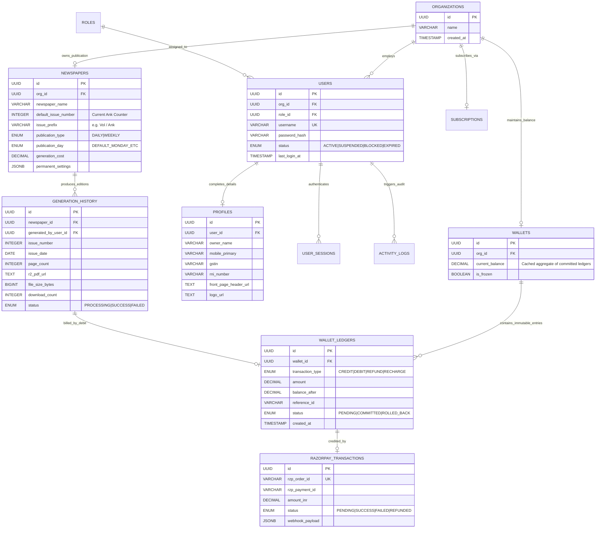
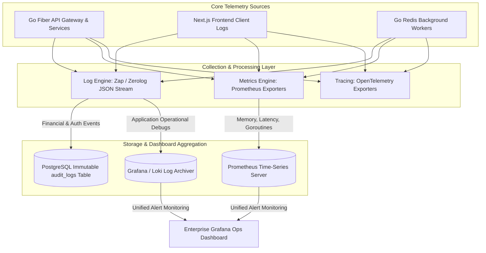

# Volume 2: Enterprise Database Schema, Algorithms & Audit Governance

**Project:** Newspaper Automatic Composition SaaS Platform  
**Target Audience:** Database Administrators, Lead Backend Engineers, Compliance Auditors  
**Deliverables Covered:** 3. Database ER Diagram, 4. PostgreSQL Schema, 5. Database Migration Plan, 12. Auto Issue Number Algorithm, 31. Monitoring & Logging Strategy

---

## 1. Database Entity-Relationship Diagram (Deliverable #3)

Our relational architecture enforces strict Third Normal Form (3NF) principles while leveraging advanced PostgreSQL types (JSONB, ENUM, UUIDv4) for optimal data modeling. Every financial event is backed by an immutable ledger paradigm.



---

## 2. PostgreSQL 3NF Normalized Schema (Deliverable #4)

```sql
-- PostgreSQL 16 Enterprise Schema Specification
-- Turn on strict UTC time zone and UUID extension support
SET timezone = 'UTC';
CREATE EXTENSION IF NOT EXISTS "uuid-ossp";
CREATE EXTENSION IF NOT EXISTS "pg_trgm"; -- Enabled for rapid GIN text keyword search across profiles

-- ENUM Type Declarations
CREATE TYPE user_status AS ENUM ('ACTIVE', 'SUSPENDED', 'BLOCKED', 'EXPIRED');
CREATE TYPE pub_type AS ENUM ('DAILY', 'WEEKLY');
CREATE TYPE pub_day AS ENUM ('MONDAY', 'TUESDAY', 'WEDNESDAY', 'THURSDAY', 'FRIDAY', 'SATURDAY', 'SUNDAY', 'ALL');
CREATE TYPE ledger_txn_type AS ENUM ('CREDIT', 'DEBIT', 'REFUND', 'RECHARGE', 'SUBSCRIPTION_FEE', 'MANUAL_ADJUST');
CREATE TYPE ledger_status AS ENUM ('PENDING_DEBIT', 'COMMITTED_DEBIT', 'REFUNDED_FAIL', 'COMMITTED_CREDIT');
CREATE TYPE gen_status AS ENUM ('PROCESSING', 'SUCCESS', 'FAILED');
CREATE TYPE sub_status AS ENUM ('PENDING', 'CONTACTED', 'APPROVED', 'REJECTED', 'CONVERTED');

-- 1. Organizations & Roles
CREATE TABLE roles (
    id UUID PRIMARY KEY DEFAULT uuid_generate_v4(),
    role_name VARCHAR(50) UNIQUE NOT NULL,
    description TEXT,
    created_at TIMESTAMPTZ DEFAULT CURRENT_TIMESTAMP
);

CREATE TABLE organizations (
    id UUID PRIMARY KEY DEFAULT uuid_generate_v4(),
    org_name VARCHAR(150) NOT NULL,
    contact_email VARCHAR(255) NOT NULL,
    created_at TIMESTAMPTZ DEFAULT CURRENT_TIMESTAMP,
    updated_at TIMESTAMPTZ DEFAULT CURRENT_TIMESTAMP
);

-- 2. Core Users & Credentials (NO OTP, Strict Admin Provisioned)
CREATE TABLE users (
    id UUID PRIMARY KEY DEFAULT uuid_generate_v4(),
    organization_id UUID NOT NULL REFERENCES organizations(id) ON DELETE RESTRICT,
    role_id UUID NOT NULL REFERENCES roles(id) ON DELETE RESTRICT,
    username VARCHAR(100) UNIQUE NOT NULL,
    password_hash VARCHAR(255) NOT NULL,
    status user_status NOT NULL DEFAULT 'ACTIVE',
    failed_login_attempts INTEGER DEFAULT 0,
    locked_until TIMESTAMPTZ NULL,
    last_login_at TIMESTAMPTZ NULL,
    created_at TIMESTAMPTZ DEFAULT CURRENT_TIMESTAMP,
    updated_at TIMESTAMPTZ DEFAULT CURRENT_TIMESTAMP,
    CONSTRAINT chk_username_len CHECK (char_length(username) >= 4)
);

-- 3. Detailed Profiles & Media Identifiers
CREATE TABLE profiles (
    id UUID PRIMARY KEY DEFAULT uuid_generate_v4(),
    user_id UUID UNIQUE NOT NULL REFERENCES users(id) ON DELETE CASCADE,
    owner_name VARCHAR(150) NOT NULL,
    owner_photo_url TEXT,
    mobile_primary VARCHAR(20) NOT NULL,
    mobile_alternate VARCHAR(20),
    email VARCHAR(255) NOT NULL,
    address_line_1 TEXT NOT NULL,
    city VARCHAR(100) NOT NULL,
    district VARCHAR(100) NOT NULL,
    state VARCHAR(100) NOT NULL,
    country VARCHAR(50) DEFAULT 'India',
    pincode VARCHAR(20) NOT NULL,
    gstin VARCHAR(30) UNIQUE,
    pan_number VARCHAR(20) UNIQUE,
    aadhar_optional VARCHAR(30),
    printing_press_name VARCHAR(150),
    printing_press_address TEXT,
    printing_contact_mobile VARCHAR(20),
    rni_number VARCHAR(50) UNIQUE NOT NULL,
    registration_number VARCHAR(100),
    logo_url TEXT,
    front_page_header_url TEXT,
    inner_page_header_url TEXT,
    digital_signature_url TEXT,
    official_stamp_url TEXT,
    created_at TIMESTAMPTZ DEFAULT CURRENT_TIMESTAMP,
    updated_at TIMESTAMPTZ DEFAULT CURRENT_TIMESTAMP
);

-- 4. Permanent Newspaper Settings & Default Issue Configurations
CREATE TABLE newspapers (
    id UUID PRIMARY KEY DEFAULT uuid_generate_v4(),
    organization_id UUID UNIQUE NOT NULL REFERENCES organizations(id) ON DELETE RESTRICT,
    newspaper_name VARCHAR(200) NOT NULL,
    edition_name VARCHAR(100) NOT NULL,
    language VARCHAR(50) NOT NULL DEFAULT 'Hindi',
    publication_type pub_type NOT NULL DEFAULT 'DAILY',
    publication_day pub_day NOT NULL DEFAULT 'ALL',
    default_issue_number INTEGER NOT NULL DEFAULT 1,
    issue_prefix VARCHAR(50) DEFAULT 'Ank',
    default_page_count INTEGER NOT NULL CHECK (default_page_count IN (6, 8, 12, 24)),
    generation_cost DECIMAL(10,2) NOT NULL DEFAULT 100.00,
    permanent_settings JSONB NOT NULL DEFAULT '{}'::jsonb,
    is_locked BOOLEAN DEFAULT FALSE,
    created_at TIMESTAMPTZ DEFAULT CURRENT_TIMESTAMP,
    updated_at TIMESTAMPTZ DEFAULT CURRENT_TIMESTAMP
);

-- 5. Wallet Architecture & Double-Entry Ledgers
CREATE TABLE wallets (
    id UUID PRIMARY KEY DEFAULT uuid_generate_v4(),
    organization_id UUID UNIQUE NOT NULL REFERENCES organizations(id) ON DELETE RESTRICT,
    current_balance DECIMAL(12,2) NOT NULL DEFAULT 0.00,
    is_frozen BOOLEAN DEFAULT FALSE,
    expires_at TIMESTAMPTZ NULL,
    updated_at TIMESTAMPTZ DEFAULT CURRENT_TIMESTAMP,
    CONSTRAINT chk_non_negative_balance CHECK (current_balance >= 0.00)
);

CREATE TABLE wallet_ledgers (
    id UUID PRIMARY KEY DEFAULT uuid_generate_v4(),
    wallet_id UUID NOT NULL REFERENCES wallets(id) ON DELETE RESTRICT,
    transaction_type ledger_txn_type NOT NULL,
    amount DECIMAL(12,2) NOT NULL,
    balance_after DECIMAL(12,2) NOT NULL,
    reference_id VARCHAR(150), -- Links to generation_history UUID or Razorpay Order ID
    description TEXT NOT NULL,
    status ledger_status NOT NULL DEFAULT 'COMMITTED_CREDIT',
    created_at TIMESTAMPTZ DEFAULT CURRENT_TIMESTAMP
);

-- 6. Generation History (Partitioned ready by date structure)
CREATE TABLE generation_history (
    id UUID PRIMARY KEY DEFAULT uuid_generate_v4(),
    newspaper_id UUID NOT NULL REFERENCES newspapers(id) ON DELETE RESTRICT,
    generated_by_user_id UUID NOT NULL REFERENCES users(id) ON DELETE RESTRICT,
    issue_number INTEGER NOT NULL,
    issue_date DATE NOT NULL,
    page_count INTEGER NOT NULL,
    r2_pdf_url TEXT NULL,
    file_size_bytes BIGINT DEFAULT 0,
    generation_duration_ms INTEGER DEFAULT 0,
    download_count INTEGER DEFAULT 0,
    status gen_status NOT NULL DEFAULT 'PROCESSING',
    created_at TIMESTAMPTZ DEFAULT CURRENT_TIMESTAMP,
    CONSTRAINT uq_newspaper_issue_date UNIQUE (newspaper_id, issue_date),
    CONSTRAINT uq_newspaper_issue_number UNIQUE (newspaper_id, issue_number)
);

-- 7. Razorpay Payments & GST Invoices
CREATE TABLE razorpay_payments (
    id UUID PRIMARY KEY DEFAULT uuid_generate_v4(),
    organization_id UUID NOT NULL REFERENCES organizations(id) ON DELETE RESTRICT,
    rzp_order_id VARCHAR(150) UNIQUE NOT NULL,
    rzp_payment_id VARCHAR(150) UNIQUE NULL,
    rzp_signature TEXT NULL,
    amount_inr DECIMAL(10,2) NOT NULL,
    gst_tax_amount DECIMAL(10,2) NOT NULL DEFAULT 0.00,
    invoice_number VARCHAR(100) UNIQUE NOT NULL,
    gateway_response JSONB NULL,
    status VARCHAR(50) DEFAULT 'PENDING',
    created_at TIMESTAMPTZ DEFAULT CURRENT_TIMESTAMP,
    completed_at TIMESTAMPTZ NULL
);

-- 8. Subscription Lead Inflow
CREATE TABLE subscription_requests (
    id UUID PRIMARY KEY DEFAULT uuid_generate_v4(),
    owner_name VARCHAR(150) NOT NULL,
    organization_name VARCHAR(150) NOT NULL,
    newspaper_name VARCHAR(200) NOT NULL,
    city VARCHAR(100) NOT NULL,
    state VARCHAR(100) NOT NULL,
    mobile VARCHAR(20) NOT NULL,
    email VARCHAR(255) NOT NULL,
    existing_software VARCHAR(150),
    monthly_requirement TEXT,
    expected_users INTEGER DEFAULT 1,
    message TEXT,
    status sub_status DEFAULT 'PENDING',
    admin_notes TEXT NULL,
    created_at TIMESTAMPTZ DEFAULT CURRENT_TIMESTAMP,
    updated_at TIMESTAMPTZ DEFAULT CURRENT_TIMESTAMP
);

-- 9. Comprehensive System Audit Logging
CREATE TABLE audit_logs (
    id UUID PRIMARY KEY DEFAULT uuid_generate_v4(),
    user_id UUID NULL REFERENCES users(id) ON DELETE SET NULL,
    action_type VARCHAR(100) NOT NULL, -- e.g. LOGIN_SUCCESS, WALLET_DEBUT, PROFILE_MODIFIED
    target_resource VARCHAR(150) NOT NULL,
    ip_address INET NULL,
    user_agent TEXT NULL,
    metadata JSONB NULL,
    created_at TIMESTAMPTZ DEFAULT CURRENT_TIMESTAMP
);

-- INDEXING ARCHIVES (To guarantee millisecond query performance under 1M load)
CREATE INDEX idx_users_org ON users(organization_id);
CREATE INDEX idx_profiles_mobile_email ON profiles(mobile_primary, email);
CREATE INDEX idx_ledger_wallet_created ON wallet_ledgers(wallet_id, created_at DESC);
CREATE INDEX idx_gen_history_newspaper_date ON generation_history(newspaper_id, issue_date DESC);
CREATE INDEX idx_audit_logs_user_action ON audit_logs(user_id, action_type, created_at DESC);
CREATE INDEX idx_sub_requests_status ON subscription_requests(status) WHERE status = 'PENDING';
```

---

## 3. Database Migration Plan & Zero-Downtime Governance (Deliverable #5)

In an enterprise publishing SaaS environment, database migrations cannot cause service downtime or lock tables during active newspaper production windows.

### 3.1 Migration Strategy & Tooling
We utilize **Goose (Go SQL Migration Engine)** integrated directly into the Go Fiber application command-line binary. All migrations occur via versioned, reversible atomic SQL scripts (`20260803_init.sql`, `20260901_add_index.sql`).

### 3.2 Zero-Downtime Schema Evolution Protocols
1. **Adding Columns to Giant Tables (e.g., Ledgers/History):**
   * *Rule:* Never execute `ALTER TABLE ... ADD COLUMN col TEXT DEFAULT 'val' NOT NULL;` on active production tables exceeding 500,000 rows without a phased approach, as this triggers a massive full-table rewrite lock.
   * *Safe Approach:* 
     1. Add nullable column without constraints: `ALTER TABLE generation_history ADD COLUMN watermark_text TEXT NULL;`.
     2. Deploy updated application pods that read/write both new and old structures.
     3. Backfill data in small concurrent batches during low-traffic windows.
     4. Finally, enforce constraints via `ALTER TABLE ... VALIDATE CONSTRAINT`.
2. **Concurrent Indexing:**
   * All structural indexes are strictly created using `CREATE INDEX CONCURRENTLY` to avoid exclusive table locks against concurrent newspaper publication write streams.

---

## 4. Auto-Issue Number (Ank) Algorithm & Concurrency Defense (Deliverable #12)

A common point of failure in publishing management systems is issue number desynchronization, occurring when two operators from the same newsroom attempt to generate today's paper simultaneously, creating conflicting "Issue #125" records.

### 4.1 ACID Row-Level Locking Algorithm
When an operator requests generation via `/api/v1/newspapers/generate`, our Go Fiber backend executes the following transactional algorithm using PostgreSQL **Serializable Row Locking (`FOR UPDATE`)**:

```go
// Real-world Go / SQLX transaction logic for consistent Ank calculation
func (s *NewspaperService) CalculateAndLockNextIssue(ctx context.Context, db *sqlx.DB, newspaperID uuid.UUID, targetDate time.Time, isSpecial bool) (*IssueMetadata, error) {
    tx, err := db.BeginTxx(ctx, &sql.TxOptions{Isolation: sql.LevelSerializable})
    if err != nil {
        return nil, fmt.Errorf("transaction begin failed: %w", err)
    }
    defer tx.Rollback() // Safe automatic discard if not committed

    // 1. Lock the newspaper setting row exclusively against competing worker threads
    var nw Newspaper
    query := `SELECT id, default_issue_number, publication_type, publication_day, issue_prefix 
              FROM newspapers WHERE id = $1 FOR UPDATE`
    if err := tx.GetContext(ctx, &nw, query, newspaperID); err != nil {
        return nil, fmt.Errorf("failed to acquire newspaper lock: %w", err)
    }

    // 2. Perform schedule compliance verification
    if nw.PublicationType == "WEEKLY" && !isSpecial {
        requestedDay := strings.ToUpper(targetDate.Format("Monday"))
        if string(nw.PublicationDay) != "ALL" && string(nw.PublicationDay) != requestedDay {
            return nil, fmt.Errorf("schedule error: newspaper is weekly on %s, requested %s", nw.PublicationDay, requestedDay)
        }
    }

    // 3. Prevent duplicate publication dates (Unless explicitly marked as a special supplement)
    if !isSpecial {
        var existingCount int
        chkQuery := `SELECT COUNT(1) FROM generation_history 
                     WHERE newspaper_id = $1 AND issue_date = $2 AND status IN ('SUCCESS', 'PROCESSING')`
        tx.GetContext(ctx, &existingCount, chkQuery, newspaperID, targetDate.Format("2006-01-02"))
        if existingCount > 0 {
            return nil, errors.New("duplicate error: an issue for this date has already been generated or is currently processing")
        }
    }

    // 4. Determine Ank sequence
    assignedAnk := nw.DefaultIssueNumber
    nextAnk := assignedAnk
    if !isSpecial {
        nextAnk = assignedAnk + 1
        // Commit incremented number to preventing any concurrent transaction from claiming it
        updQuery := `UPDATE newspapers SET default_issue_number = $1, updated_at = NOW() WHERE id = $2`
        if _, err := tx.ExecContext(ctx, updQuery, nextAnk, newspaperID); err != nil {
            return nil, fmt.Errorf("failed to increment ank counter: %w", err)
        }
    }

    if err := tx.Commit(); err != nil {
        return nil, fmt.Errorf("commit failed during ank calculation: %w", err)
    }

    return &IssueMetadata{
        IssueNumber: assignedAnk,
        IssuePrefix: nw.IssuePrefix,
        IssueDate:   targetDate,
        Formatted:   fmt.Sprintf("%s %d", nw.IssuePrefix, assignedAnk),
    }, nil
}
```

### 4.2 Why This Beats In-Memory Alternatives
If an algorithm stores the issue counter purely in Redis or relies on simple SELECTs without `FOR UPDATE`, concurrent HTTP requests will read the same `default_issue_number` simultaneously, dispatch two duplicate PDFs to the printing press, and cause publishing errors. Row-level serializable locking guarantees deterministic sequence ordering.

---

## 5. Monitoring & Audit Logging Strategy (Deliverable #31)

An enterprise SaaS portal requires comprehensive observability into every system action, user log-in event, and financial transaction for audit purposes and troubleshooting.

### 5.1 Three-Pillars Observability Architecture



### 5.2 Mandatory Auditing Trigger Rules
Any operation falling within the following categories automatically spawns an immutable record inside the `audit_logs` SQL table via an asynchronous writer pool:

1. **Authentication:** Successful login, password failures exceeding 3 attempts, manual JWT session termination by admin.
2. **Financial Mutations:** Any change to wallet ledgers, Razorpay payment captures, manual balance adjustments by Finance admins.
3. **Publishing Integrity:** Newspaper generation initiation, download link retrieval, modification of registered RNI or GST profile IDs.
4. **Administrative Interventions:** Account suspension, password resets, system pricing changes.
