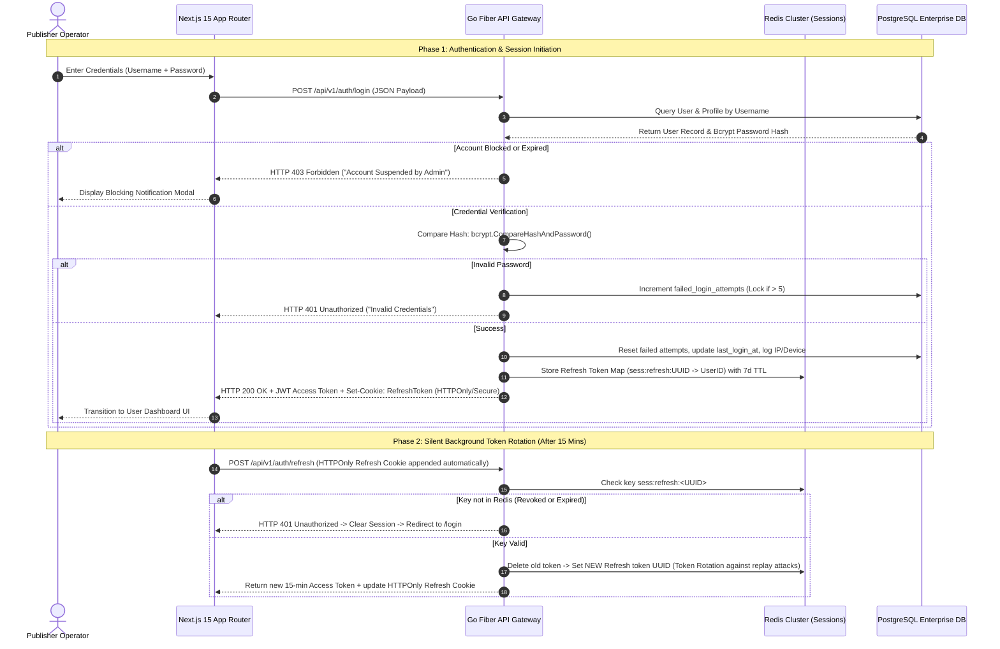

# Volume 3: Security Architecture, Zero-Trust Authentication & RBAC Matrix

**Project:** Newspaper Automatic Composition SaaS Platform  
**Target Audience:** Security Engineers, Penetration Testers, Compliance & Audit Officers  
**Deliverables Covered:** 7. Authentication Flow Diagram, 13. RBAC Permission Matrix, 14. Security Architecture & Threat Mitigation

---

## 1. Zero-Trust Authentication Architecture (Deliverable #7)

### 1.1 Closed Enterprise Provisioning Model
Unlike conventional consumer B2C SaaS applications, the **Newspaper Publishing SaaS Portal** operates under a strictly curated **Closed B2B Enterprise Model**:
* **No User Registration:** Public registration endpoints are completely disabled. Users cannot self-sign up.
* **No OTP or SMS Verification:** Authentication avoids unreliable cellular SMS channels or third-party email OTP verification loops during login.
* **Admin-Exclusive Onboarding:** All user identities, credentials, and initial wallet balances are created exclusively by authorized administrative staff via secure admin endpoints.
* **Single Tenant Binding:** Each individual user account is bound to exactly one registered Newspaper publishing organization (`users.organization_id = newspapers.organization_id`), preventing lateral data leakage across publications.

### 1.2 Comprehensive JWT & Refresh Token Authentication Flow

To combine ultra-low-latency API authorization with instantaneous revocation capabilities (such as blocking a user or terminating a session upon an administrative ban), we employ a **Dual-Token Zero-Trust Rotation Schema**:
1. **Access Token (Short-Lived JWT - 15 Minutes):** Transmitted via standard `Authorization: Bearer <token>` header. Contains zero sensitive data; strictly payloads `user_id`, `org_id`, and `role_name`. Verified entirely in Go Fiber middleware RAM via asymmetric cryptographic Ed25519 or ES256 algorithm public keys without querying the database.
2. **Refresh Token (Long-Lived State Token - 7 Days):** Stored exclusively in an `HTTPOnly`, `Secure`, `SameSite=Strict` browser cookie. The refresh token hash is mirrored inside our Redis Cluster (`sess:refresh:<uuid>`). If an admin disables an account or resets a user's password, the Redis key is dropped instantly, invalidating future access token refreshes system-wide.



---

## 2. Comprehensive RBAC Permission Matrix (Deliverable #13)

To secure operations across thousands of participating newspaper publishers and internal enterprise staff, we enforce a highly granular, Role-Based Access Control (RBAC) governance framework.

### 2.1 Role Definitions
1. **Super Admin:** Ultimate platform custodian. Modifies systemic pricing, adds sub-administrators, and manages payment gateway cryptographic keys.
2. **Admin:** Operational manager. Creates publishing houses, assigns users, initializes newspaper settings, and moderates subscription lead queues.
3. **Finance:** Specialized financial accounting role. Manages wallets, executes refunds, generates ledger audits, and handles GST invoicing without editing user publishing layouts.
4. **Support:** Customer satisfaction technician. Can unlock user accounts, inspect error logs, and assist with profile configurations without access to financial mutations or gateway keys.
5. **Operator:** The core publishing end-user (Editor/Layout Artist). Configures layouts, uploads mastheads, consumes wallet balances to generate newspapers, and downloads finalized print PDFs.
6. **Viewer:** Read-only executive or auditor within a publishing organization. Can monitor PDF history, review wallet balances, and view past newspaper downloads, but cannot initiate generation tasks or modify profiles.

### 2.2 Complete Access Governance Table

| Feature Domain | Operational Action / API Endpoint Target | Super Admin | Admin | Support | Finance | Operator (User) | Viewer (User) |
| :--- | :--- | :---: | :---: | :---: | :---: | :---: | :---: |
| **User Management** | Create / Import new user accounts & assign orgs | 🟢 Allow | 🟢 Allow | 🔴 Deny | 🔴 Deny | 🔴 Deny | 🔴 Deny |
| | Suspend / Block / Expire / Revoke existing user access | 🟢 Allow | 🟢 Allow | 🔴 Deny | 🔴 Deny | 🔴 Deny | 🔴 Deny |
| | Force Password Reset & Clear Failed Lockout Counters | 🟢 Allow | 🟢 Allow | 🟢 Allow | 🔴 Deny | 🔴 Deny | 🔴 Deny |
| | View Global Login Logs, Device Histories & IP Tracks | 🟢 Allow | 🟢 Allow | 🟢 Allow | 🔴 Deny | 🔴 Deny (Own Only) | 🔴 Deny (Own Only) |
| **Profile & RNI Setup** | Edit Publisher Identity, GSTIN, PAN, RNI Registration | 🟢 Allow | 🟢 Allow | 🟢 Allow | 🔴 Deny | 🟢 Allow (Own Org) | 🔴 Deny |
| | Upload Mastheads, Logos, Digital Signatures, & Stamps | 🟢 Allow | 🟢 Allow | 🟢 Allow | 🔴 Deny | 🟢 Allow (Own Org) | 🔴 Deny |
| **Newspaper Settings**| Modify Default Page Count, Edition Margins & Theme | 🟢 Allow | 🟢 Allow | 🟢 Allow | 🔴 Deny | 🟢 Allow (Own Org) | 🔴 Deny |
| | Modify System Generation Cost per newspaper (₹ Price) | 🟢 Allow | 🟢 Allow | 🔴 Deny | 🟢 Allow | 🔴 Deny | 🔴 Deny |
| **Issue Number (Ank)**| Auto-increment during automated generation job | 🟢 Allow | 🟢 Allow | 🔴 Deny | 🔴 Deny | 🟢 Allow (Own Org) | 🔴 Deny |
| | Manual Issue Number Reset / Force Override / Lock | 🟢 Allow | 🟢 Allow | 🔴 Deny | 🔴 Deny | 🔴 Deny | 🔴 Deny |
| **Wallet & Accounting** | View Live Balance & Immutable Transaction Ledgers | 🟢 Allow | 🟢 Allow | 🔴 Deny | 🟢 Allow | 🟢 Allow (Own Org) | 🟢 Allow (Own Org) |
| | Execute Manual Balance Adjustment (Credit/Debit/Refund) | 🟢 Allow | 🔴 Deny | 🔴 Deny | 🟢 Allow | 🔴 Deny | 🔴 Deny |
| | Freeze / Unfreeze Publisher Wallet (Blocking Generation) | 🟢 Allow | 🟢 Allow | 🔴 Deny | 🟢 Allow | 🔴 Deny | 🔴 Deny |
| **Payment Gateway** | Initiate Online Razorpay Wallet Recharge Transaction | 🟢 Allow | 🟢 Allow | 🔴 Deny | 🔴 Deny | 🟢 Allow (Own Org) | 🔴 Deny |
| | Download GST Invoices & Payment Gateway Receipts | 🟢 Allow | 🟢 Allow | 🔴 Deny | 🟢 Allow | 🟢 Allow (Own Org) | 🟢 Allow (Own Org) |
| **Newspaper Generation**| Initiate Live Generation Job via Generator Engine API | 🟢 Allow | 🟢 Allow | 🔴 Deny | 🔴 Deny | 🟢 Allow (Own Org) | 🔴 Deny |
| | Preview, Share & Download Generated R2 Print PDFs | 🟢 Allow | 🟢 Allow | 🟢 Allow | 🟢 Allow | 🟢 Allow (Own Org) | 🟢 Allow (Own Org) |
| | Delete Archived PDF Files from Cloud Storage | 🟢 Allow | 🟢 Allow | 🔴 Deny | 🔴 Deny | 🟢 Allow (Own Org) | 🔴 Deny |
| **System Settings** | Modify Razorpay Keys, Resend SMTP & R2 Storage Configs | 🟢 Allow | 🔴 Deny | 🔴 Deny | 🔴 Deny | 🔴 Deny | 🔴 Deny |
| **Analytics & Reports** | View Revenue Growth, Server Costs & Storage Summaries | 🟢 Allow | 🟢 Allow | 🔴 Deny | 🟢 Allow | 🔴 Deny | 🔴 Deny |

---

## 3. Comprehensive Security Architecture & Threat Mitigation (Deliverable #14)

Building a high-profile publishing and content generation system requires deep, layered defensive controls against external cyber attacks and internal data anomalies.

### 3.1 SQL Injection Protection Architecture
* **Strict Parameterization:** Zero string interpolation or raw SQL string formatting is permitted anywhere in our Go Fiber storage repository layer.
* **Prepared Statement Caching:** By leveraging **SQLX & PostgreSQL Prepared Statements**, SQL query logic is compiled by the database execution engine before parameters are bound, rendering SQL injection payloads impossible to execute.

### 3.2 XSS (Cross-Site Scripting) & CSRF Defense
1. **Input Sanitization:** All text parameters submitted during profile onboarding (owner name, press address, registration number) pass through strict HTML escape serialization to strip any inadvertent or malicious `<script>`, `onload=`, or JavaScript link vectors before database commitment.
2. **CSRF Mitigation:** 
   - Because our 15-minute Access Tokens are stored exclusively in Javascript memory (or Zustand store) rather than auto-submitted cookies, cross-site request forgery attacks targeting standard CRUD APIs fail out of the box.
   - For state-altering operations leveraging the HTTPOnly Refresh Cookie (e.g., token rotation and explicit logout), the backend enforces a mandatory **Double-Submit Cookie CSRF Token Pattern** and strict origin header validation (`Origin: https://portal.newspaper-erp.com`).

### 3.3 HTTP Response Security Headers (Fiber Helmet Configuration)
Every single outgoing HTTP response served by our Nginx gateway and Go Fiber servers injects strict industry-standard security headers:

```http
Strict-Transport-Security: max-age=63072000; includeSubDomains; preload
Content-Security-Policy: default-src 'self'; img-src 'self' data: https://cdn.newspaper-erp.com https://*.cloudflare.com; style-src 'self' 'unsafe-inline' https://fonts.googleapis.com; font-src 'self' https://fonts.gstatic.com; frame-ancestors 'none';
X-Frame-Options: DENY
X-Content-Type-Options: nosniff
Referrers-Policy: strict-origin-when-cross-origin
Permissions-Policy: geolocation=(), microphone=(), camera=(), payment=(self "https://api.razorpay.com")
```
*Note:* `X-Frame-Options: DENY` and `frame-ancestors 'none'` prevent malicious third-party portals from iframe-embedding our publishing system to execute clickjacking attacks against user wallet recharges.

### 3.4 DDoS & Brute-Force Rate Limiting Strategy
We implement a three-tiered rate-limiting defense hierarchy utilizing Redis Sorted Sets (`ZSET` timestamp indexing):
1. **Global Firewall Layer (Cloudflare Edge):** Drops Layer 3/4 SYN floods and basic HTTP volumetric attacks before reaching VPS ingress.
2. **Unauthenticated Authentication Shield (Go Fiber Middleware):** Requests to `/api/v1/auth/login` are strictly throttled to **5 requests per minute per IP address**. Exceeding this threshold places the IP on an automated 30-minute cooling blacklist.
3. **Authenticated Tenant Quotas:** To prevent an automated script or compromised operator token from overwhelming our external Newspaper Generator Engine queue, newspaper generation triggers (`/api/v1/newspapers/generate`) are capped at **2 concurrent executions per publishing organization per minute**.
