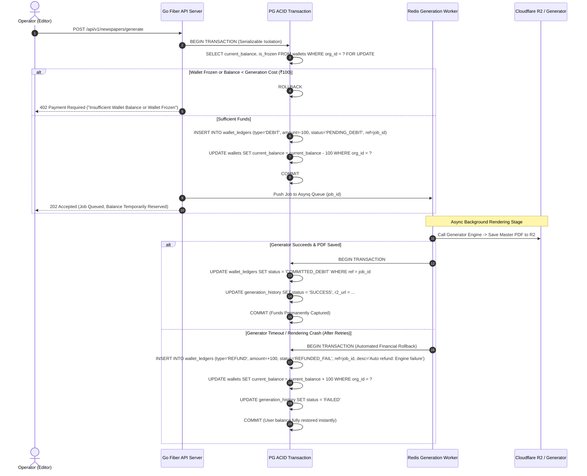
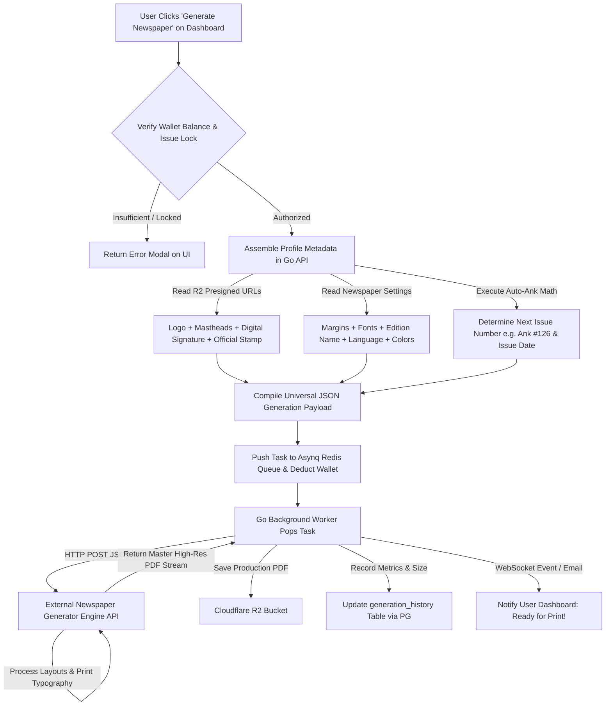

# Volume 4: Financial Workflows, Generator Ops & OpenAPI Specification

**Project:** Newspaper Automatic Composition SaaS Platform  
**Target Audience:** Fintech Engineers, Backend Architects, Frontend Integration Teams  
**Deliverables Covered:** 6. REST API Documentation (Swagger/OpenAPI), 8. Wallet Workflow, 9. Razorpay Workflow, 10. Subscription Workflow, 11. Newspaper Generation Workflow

---

## 1. Wallet Architecture & Double-Entry Ledger Workflow (Deliverable #8)

In a high-concurrency commercial SaaS platform, managing user balances via simple CRUD updates (e.g., `UPDATE wallets SET balance = balance - 100 WHERE id = 1`) introduces catastrophic vulnerabilities, including negative balance underflows during concurrent rendering and total lack of auditable financial lineage.

### 1.1 Double-Entry Ledger Accounting Model
We implement a strict **Immutable Ledger Accounting Architecture**:
* **No Direct Mutations:** The `wallets.current_balance` column serves purely as a cached performance aggregate. All actual balances are mathematically derived from the continuous summing of `wallet_ledgers` records.
* **Non-Repudiation:** Once inserted, rows in `wallet_ledgers` are permanently append-only. Deletions or updates to existing ledger rows are enforced as impossible via database triggers and user permission limitations.
* **Two-Phase Reservation Processing:** To eliminate double-spend hazards when interacting with external processing generators, wallet balance deductions operate via a Reserve $\rightarrow$ Commit / Rollback paradigm.



---

## 2. Razorpay Payment Gateway & Webhook Verification Workflow (Deliverable #9)

To allow publishers to top up their account balance seamlessly without administrative overhead, we integrate **Razorpay** supporting UPI, NetBanking, Debit/Credit Cards, and Enterprise Invoicing with GST compliance.

### 2.1 Cryptographic Order & Capture Pipeline

```mermaid
graph TD
    UI[Next.js Dashboard: Select Recharge Plan ₹2000 / Custom] -->|POST /api/v1/payments/order| GF[Go Fiber API Gateway]
    GF -->|Create Order| RZP_API[Razorpay Server via Go SDK]
    RZP_API -->|Return order_id| GF
    GF -->|Store PENDING in razorpay_payments DB| PG[(PostgreSQL)]
    GF -->|Return order_id & Public Key| UI
    
    UI -->|Open Razorpay Checkout JS Modal| USER[Publisher Completes Payment]
    USER -->|Success Response| UI
    UI -->|POST /api/v1/payments/verify| GF
    
    RZP_SERVER[Razorpay Webhook Engine] -->|POST /api/v1/webhooks/razorpay| GF
    
    subgraph Security Gate & Ledger Credit (Inside Go Backend)
        VERIFY{Validate HMAC-SHA256 Signature}
        VERIFY -->|Signature Mismatch / Fraud| REJECT[Log Alert & Ignore]
        VERIFY -->|Signature Valid & Order PENDING| LEDGER[Execute ACID Transaction]
        LEDGER -->|1. Mark Payment SUCCESS| PG
        LEDGER -->|2. Generate GST Invoice Number| PG
        LEDGER -->|3. Append CREDIT to wallet_ledgers| PG
        LEDGER -->|4. Update wallets.current_balance| PG
        LEDGER -->|5. Send Resend Confirmation Email| MAIL[Resend Email Engine]
    end
```

### 2.2 Webhook Idempotency & Signature Verification Engineering
To prevent attackers from sending fake recharge confirmations or network retries causing double credits:
1. **Cryptographic Proof Verification:** When Razorpay triggers `/api/v1/webhooks/razorpay`, the Go Fiber handler ignores payload content until verifying the cryptographic signature:
   $$\text{Generated Signature} = \text{HMAC-SHA256}(\text{RequestBody}, \text{RazorpayWebhookSecret})$$
   If $\text{Generated Signature} \neq \text{Header}[\text{X-Razorpay-Signature}]$, the request is dropped immediately with an HTTP 400 Bad Request error.
2. **Idempotent Duplicate Protection:** Before executing a ledger credit, the backend issues an atomic check: `SELECT id FROM razorpay_payments WHERE rzp_payment_id = $1 AND status = 'SUCCESS'`. If a record exists, the system immediately responds `200 OK` to Razorpay without re-running wallet accounting logic.

---

## 3. Subscription Lead Funnel Workflow (Deliverable #10)

Public visitors and regional newspaper agency proprietors visiting our SaaS web presence cannot sign up directly. They navigate through an optimized SaaS onboarding funnel.

### 3.1 Lead Lifecycle Transition State

```mermaid
stateDiagram-v2
    [*] --> PENDING: Visitor submits form on public landing page
    PENDING --> CONTACTED: Admin or Support reviews in Admin Portal & marks initial outreach
    CONTACTED --> REJECTED: Unqualified lead / duplicate inquiry
    CONTACTED --> APPROVED: Terms agreed; Pricing & Edition volume established
    APPROVED --> CONVERTED: Admin clicks 'Convert to Active Publisher'
    CONVERTED --> [*]: Backend auto-provisions Organization, User credentials & Initial Wallet
    REJECTED --> [*]
```


### 3.2 Automated One-Click Conversion Engine
When an administrator selects a lead in the Admin Panel and executes `"Convert to Publisher"`, the Go Fiber backend performs an atomic initialization sequence:
1. Generates a secure, normalized unique username (e.g., `rni_press_times`) and a high-entropy 12-character alphanumeric password.
2. Hashes the password using `bcrypt` (cost factor 12).
3. Creates corresponding records across `organizations`, `users`, `newspapers` (with default page counts & publication schedule), and an initialized `wallets` profile.
4. Updates `subscription_requests.status = 'CONVERTED'`.
5. Dispatches a secure welcome email containing encrypted access instructions and initial balance details via Resend SMTP.

---

## 4. Newspaper Generation & Composition Workflow (Deliverable #11)

This sequence describes how saved profile branding, RNI regulatory headers, and dynamic dates unify during newspaper generation.



---

## 5. Comprehensive REST API Architecture (Deliverable #6)

### 5.1 API Conventions & Structural Principles
* **Base Protocol & Versioning:** All endpoints route under HTTPS via prefix `/api/v1/`.
* **Standardized Error Formatting (RFC 7807 Pattern):** Whenever an error occurs, the server avoids plaintext responses, consistently returning an explicit JSON schema:
  ```json
  {
    "success": false,
    "error_code": "ERR_WALLET_INSUFFICIENT",
    "message": "Your usable wallet balance is ₹50, which is lower than the ₹100 required for newspaper generation.",
    "timestamp": "2026-08-03T17:15:00Z",
    "path": "/api/v1/newspapers/generate"
  }
  ```
* **Universal Pagination Schema:** All directory list operations support structured pagination: `?page=1&limit=20&sort=created_at&order=desc`.
  ```json
  {
    "success": true,
    "data": [ { "id": "uuid...", "issue_number": 125 } ],
    "meta": { "current_page": 1, "per_page": 20, "total_records": 482, "total_pages": 25 }
  }
  ```

### 5.2 Complete Enterprise API Specification Catalog

| Module | HTTP Method | Endpoint URI Path | Description | Access Role Required |
| :--- | :---: | :--- | :--- | :---: |
| **Authentication** | `POST` | `/api/v1/auth/login` | Validate credentials, issue JWT in body and Refresh token in secure cookie. | Public / Guest |
| | `POST` | `/api/v1/auth/refresh` | Silently rotate access token using valid HTTPOnly refresh cookie. | Authenticated |
| | `POST` | `/api/v1/auth/logout` | Revoke session key inside Redis and clear browser cookies. | Authenticated |
| **User Profile** | `GET` | `/api/v1/profile` | Retrieve comprehensive publisher identity, RNI details, and masthead links. | Authenticated (Any Role)|
| | `PUT` | `/api/v1/profile` | Update address, GSTIN, printing press locations, or contact phones. | Operator / Admin |
| | `POST` | `/api/v1/profile/assets` | Securely upload Logo, Front Page Header, or Digital Stamp to Cloudflare R2. | Operator / Admin |
| **Newspaper Ops** | `GET` | `/api/v1/newspapers/settings` | Retrieve active layout settings, publication day, and current Ank counter. | Authenticated (Any Role)|
| | `PUT` | `/api/v1/newspapers/settings` | Update margins, font presets, theme colors, or weekly publication scheduling. | Operator / Admin |
| | `POST` | `/api/v1/newspapers/generate` | Dispatch async generation task to Redis queue; reserve wallet balance. | Operator / Admin |
| **PDF History** | `GET` | `/api/v1/history/pdfs` | Paginated repository of historical newspaper issues with filtering & sorting. | Authenticated (Any Role)|
| | `GET` | `/api/v1/history/pdfs/:id/download` | Obtain short-lived presigned download/preview URL from Cloudflare R2. | Authenticated (Any Role)|
| | `DELETE`| `/api/v1/history/pdfs/:id` | Remove specific legacy PDF from active dashboard view (Admin override). | Operator / Admin |
| **Wallet System** | `GET` | `/api/v1/wallet/balance` | Query current real-time usable balance and check freeze/lockout states. | Authenticated (Any Role)|
| | `GET` | `/api/v1/wallet/transactions` | Retrieve immutable ledger logs (Debits, Credits, Refunds) with pagination. | Authenticated (Any Role)|
| **Razorpay Payments**|`POST`| `/api/v1/payments/order` | Create cryptographic Razorpay payment order for selected recharge amount. | Operator / Admin |
| | `POST` | `/api/v1/payments/verify` | Submit frontend transaction signature for backend cryptographic confirmation. | Operator / Admin |
| | `POST` | `/api/v1/webhooks/razorpay` | Asynchronous automated gateway verification and invoice generator webhook. | Public (Signed HMAC) |
| **Admin System** | `GET` | `/api/v1/admin/users` | Retrieve complete tenant catalog with status filters and organization linkage.| Super Admin / Admin |
| | `POST` | `/api/v1/admin/users` | Provision brand new publisher organization, login credentials, and wallet. | Super Admin / Admin |
| | `PUT` | `/api/v1/admin/users/:id/status`| Immediately suspend, block, or re-enable a target publisher account. | Super Admin / Admin |
| | `POST` | `/api/v1/admin/users/:id/reset` | Force reset account credentials and terminate all active sessions in Redis. | Admin / Support |
| | `POST` | `/api/v1/admin/wallet/adjust` | Manual accounting intervention: Credit/Debit publisher ledger with note. | Super Admin / Finance |
| | `GET` | `/api/v1/admin/analytics/overview`| Retrieve aggregate system widget stats (Daily revenue, active printers, R2 gigabytes).| Super Admin / Finance |
| | `GET` | `/api/v1/admin/subscriptions` | View public subscription leads submitted by visiting newspaper owners. | Super Admin / Admin |
| | `POST` | `/api/v1/admin/subscriptions/:id/convert`| Automate 1-click transformation of subscription lead into operational tenant.| Super Admin / Admin |
