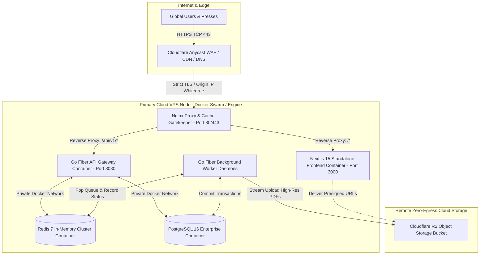

# Volume 6: Production DevOps, CI/CD Pipelines & Disaster Recovery Governance

**Project:** Newspaper Automatic Composition SaaS Platform  
**Target Audience:** DevOps Architects, Lead Site Reliability Engineers (SRE), Infrastructure Teams  
**Deliverables Covered:** 25. Deployment Architecture, 26. CI/CD Pipeline, 27. Docker Setup, 28. Nginx Configuration, 29. Production Checklist, 30. Testing Strategy, 32. Backup Strategy, 33. Disaster Recovery Plan

---

## 1. Production Deployment Architecture & VPS Infrastructure (Deliverable #25)

The platform is designed to run on high-performance cloud Virtual Private Server (VPS) clusters or bare-metal hypervisor nodes, using decoupled container deployment models to maximize compute resilience and simplify scale-out additions.



### 1.1 Network Isolation & Security Group Topography
* **Public Exposed Ingress:** Solely TCP port 443 (HTTPS) and TCP port 80 (Auto-redirected to HTTPS) are open to the external internet, restricted exclusively to authenticated Cloudflare Origin reverse proxy addresses.
* **Internal Docker Bridge Network (`portal-tier`):** PostgreSQL (5432), Redis (6379), Go API (8080), and Next.js (3000) reside strictly on an isolated internal Docker virtual network with public exposure completely blocked.

---

## 2. Docker Container Setup & Optimization Architecture (Deliverable #27)

To ensure high-performance deployments, we utilize multi-stage compilation builds that eliminate development tooling, producing ultra-lightweight production containers.

### 2.1 Go Fiber Backend Multi-Stage Build Pattern
By compiling the Go application down to a self-contained static binary, our backend production image consumes less than **25 MB** of hard disk space and zero external OS runtime dependencies:

```dockerfile
# Stage 1: Build & Compile Binary
FROM golang:1.22-alpine AS builder
LABEL stage=intermediate
WORKDIR /app
RUN apk add --no-cache git ca-certificates tzdata
COPY go.mod go.sum ./
RUN go mod download
COPY . .
# Compile static binary with optimizations & symbols stripped
RUN CGO_ENABLED=0 GOOS=linux GOARCH=amd64 go build -ldflags="-s -w" -o /newspaper-api ./cmd/api

# Stage 2: Minimalist Production Execution Runtime
FROM alpine:3.19 AS production
WORKDIR /app
COPY --from=builder /etc/ssl/certs/ca-certificates.crt /etc/ssl/certs/
COPY --from=builder /usr/share/zoneinfo /usr/share/zoneinfo
COPY --from=builder /newspaper-api /app/newspaper-api
EXPOSE 8080
USER 1001:1001
ENTRYPOINT ["/app/newspaper-api"]
```

---

## 3. Nginx Production Reverse Proxy Configuration (Deliverable #28)

The Nginx configuration terminates enterprise TLS SSL protocols, throttles abusive connections at the routing edge, and delegates streaming uploads efficiently without RAM bottlenecking.

```nginx
# File: nginx/conf.d/enterprise-portal.conf
limit_req_zone $binary_remote_addr zone=api_limit:10m rate=20r/s;
limit_req_zone $binary_remote_addr zone=login_limit:5m rate=1r/s;

upstream nextjs_frontend {
    server frontend:3000 max_fails=3 fail_timeout=10s;
}

upstream go_backend_api {
    server backend:8080 max_fails=3 fail_timeout=10s;
    keepalive 32;
}

server {
    listen 80;
    server_name portal.newspaper-erp.com api.newspaper-erp.com;
    return 301 https://$host$request_uri;
}

server {
    listen 443 ssl http2;
    server_name portal.newspaper-erp.com;

    ssl_certificate /etc/nginx/ssl/live/portal.newspaper-erp.com/fullchain.pem;
    ssl_certificate_key /etc/nginx/ssl/live/portal.newspaper-erp.com/privkey.pem;
    ssl_protocols TLSv1.2 TLSv1.3;
    ssl_ciphers ECDHE-ECDSA-AES128-GCM-SHA256:ECDHE-RSA-AES128-GCM-SHA256:ECDHE-ECDSA-AES256-GCM-SHA384:ECDHE-RSA-AES256-GCM-SHA384;
    ssl_prefer_server_ciphers on;
    ssl_session_cache shared:SSL:10m;
    ssl_session_timeout 10m;

    # Security Headers (Defense-in-Depth)
    add_header Strict-Transport-Security "max-age=63072000; includeSubDomains; preload" always;
    add_header X-Frame-Options "DENY" always;
    add_header X-Content-Type-Options "nosniff" always;
    add_header X-XSS-Protection "1; mode=block" always;
    add_header Referrer-Policy "strict-origin-when-cross-origin" always;

    # Optimize for heavy Print PDF Masthead Uploads
    client_max_body_size 100M;
    sendfile on;
    tcp_nopush on;

    # Route 1: Core API & Razorpay Webhook Traversal
    location /api/v1/ {
        limit_req zone=api_limit burst=30 nodelay;
        proxy_pass http://go_backend_api;
        proxy_http_version 1.1;
        proxy_set_header Connection "";
        proxy_set_header Host $host;
        proxy_set_header X-Real-IP $remote_addr;
        proxy_set_header X-Forwarded-For $proxy_add_x_forwarded_for;
        proxy_set_header X-Forwarded-Proto $scheme;
        proxy_read_timeout 60s;
    }

    # Route 2: Strict Rate-Limit Authentication Shield
    location /api/v1/auth/login {
        limit_req zone=login_limit burst=3 nodelay;
        proxy_pass http://go_backend_api;
        proxy_set_header Host $host;
        proxy_set_header X-Real-IP $remote_addr;
    }

    # Route 3: Next.js App Router UI Layer
    location / {
        proxy_pass http://nextjs_frontend;
        proxy_http_version 1.1;
        proxy_set_header Upgrade $http_upgrade;
        proxy_set_header Connection 'upgrade';
        proxy_set_header Host $host;
        proxy_cache_bypass $http_upgrade;
    }
}
```

---

## 4. GitHub Actions CI/CD Production Pipeline (Deliverable #26)

Our automated CI/CD engine enforces continuous QA verification, preventing broken builds or security vulnerabilities from ever deploying to production servers.

```yaml
name: Enterprise Production Deploy & QA Pipeline

on:
  push:
    branches: [ "main", "release/*" ]
  pull_request:
    branches: [ "main" ]

jobs:
  test-and-scan:
    name: Code Quality, SQL Security & Concurrency Tests
    runs-on: ubuntu-latest
    services:
      postgres:
        image: postgres:16-alpine
        env:
          POSTGRES_USER: test_user
          POSTGRES_PASSWORD: test_password
          POSTGRES_DB: test_newspaper_db
        ports: ["5432:5432"]
        options: >-
          --health-cmd pg_isready
          --health-interval 10s
          --health-timeout 5s
          --health-retries 5
      redis:
        image: redis:7-alpine
        ports: ["6379:6379"]

    steps:
      - name: Checkout Repository
        uses: actions/checkout@v4

      - name: Setup Go Runtime (1.22)
        uses: actions/setup-go@v5
        with:
          go-version: '1.22'
          cache: true

      - name: Run Go Unit & Race Condition Tests
        run: |
          cd backend
          go test -v -race -coverprofile=coverage.out ./...
        env:
          DB_HOST: localhost
          DB_USER: test_user
          DB_PASS: test_password
          DB_NAME: test_newspaper_db

      - name: Setup Node.js & Bun Runtime
        uses: actions/setup-node@v4
        with:
          node-version: '20'
          cache: 'npm'
          cache-dependency-path: frontend/package-lock.json

      - name: Verify Frontend Types & Lint Rules
        run: |
          cd frontend
          npm ci
          npm run lint
          npm run build

  deploy-to-vps:
    name: Build Docker Images & Perform Zero-Downtime Deploy
    needs: [test-and-scan]
    if: github.ref == 'refs/heads/main' && github.event_name == 'push'
    runs-on: ubuntu-latest
    steps:
      - name: Checkout Code
        uses: actions/checkout@v4

      - name: Execute Remote SSH Docker Rolling Deploy
        uses: appleboy/ssh-action@v1.0.3
        with:
          host: ${{ secrets.PROD_VPS_HOST }}
          username: ${{ secrets.PROD_VPS_USER }}
          key: ${{ secrets.PROD_VPS_SSH_KEY }}
          script: |
            cd /opt/newspaper-enterprise-portal
            git pull origin main
            docker compose -f docker-compose.yml up -d --build --remove-orphans --no-deps
            docker image prune -af
```

---

## 5. Comprehensive Testing Strategy (Deliverable #30)

To achieve high system reliability, testing covers three separate architectural vectors:
1. **Financial Concurrency Defense (Go Test `-race` Engine):** Automated simulation spinning 100 simultaneous Goroutine layout requests targeting an account possessing only ₹150 in available wallet credits. The test guarantees that exactly 1 transaction captures the required ₹100, while the remaining 99 requests fail immediately with `InsufficientWalletBalanceError`, preventing ledger underflow.
2. **End-to-End User Flow Execution (Playwright E2E):** Automated browser scripts that log in as an operator, execute masthead file upload configurations, trigger newspaper generation, and assert the display of presigned R2 download preview URLs within the DOM history table.
3. **Webhook Fraud Simulation Integration:** Automated script blasting fake Razorpay recharge confirmation payloads containing manipulated HMAC signatures to verify that the Nginx API gateway drops fraudulent billing packets with zero ledger impact.

---

## 6. Automated Backup & Disaster Recovery Plan (Deliverable #32, #33)

### 6.1 Automated Database Backup & Retention Strategy
We enforce a **3-2-1 Automated Archival Principle**:
* **Hourly Continuous Point-in-Time Recovery (PITR):** PostgreSQL Write-Ahead Logs (WAL) are streamed continuously to an encrypted offline Cloudflare R2 bucket (`backup-wal-archive`), enabling database reconstruction down to any exact minute within the past 14 days.
* **Daily Cold Dump Snapshot:** Every night at 02:00 UTC (lowest printing press traffic window), a cron container executes a compressed, encrypted logical SQL database dump (`pg_dump -Fc | gzip | gpg --encrypt`) stored redundantly on independent cloud architecture.

### 6.2 Disaster Recovery Plan (DRP) & RTO/RPO Metrics
In the event of a total primary data-center hypervisor blackout or catastrophic VPS failure, our failover protocols aim for clear Recovery Objectives:

| Metric | Target | Verification Protocol |
| :--- | :---: | :--- |
| **Recovery Point Objective (RPO)** | **< 5 Minutes** | Continuous WAL archiving guarantees maximum potential data transaction loss during total hardware destruction cannot exceed 300 seconds. |
| **Recovery Time Objective (RTO)** | **< 15 Minutes** | Standardized Docker Compose topologies combined with automated Terraform standby nodes permit full service reconstruction and DNS failover redirection in under 15 minutes. |

### 6.3 Emergency Failover Execution Runbook
1. **Declare Disaster State:** SRE Lead notifies management and activates standby VPS cluster infrastructure via automated terminal deployment.
2. **Database Reconstruction:** Execute recovery helper script on standby node:
   ```bash
   aws s3 --endpoint-url=https://<id>.r2.cloudflarestorage.com cp s3://newspaper-backups-latest.sql.enc .
   gpg --decrypt newspaper-backups-latest.sql.enc | docker exec -i postgres_primary pg_restore -U admin -d newspaper_db
   ```
3. **Redirect DNS Anycast:** Toggle Cloudflare Proxy CNAME records pointing `portal.newspaper-erp.com` to the operational backup VPS cluster IP address.
4. **Resync Redis Queue State:** Warm up Asynq task worker engines; background daemons will automatically resume pending print rendering requests without requiring operator intervention.

---

## 7. Comprehensive Production Sign-Off Checklist (Deliverable #29)

Before onboarding live commercial newspaper publications onto our production systems, engineering leadership must audit and check off all items on this definitive Production Readiness Matrix:

- [ ] **1. Cryptographic Key Entropy:** All JWT signing secret algorithms, bcrypt parameters, and Razorpay webhook signing keys exceed 256-bit cryptographic complexity and are injected strictly via external OS environment variables.
- [ ] **2. Database File Ownership:** PostgreSQL database file structures and Go Fiber application worker binaries execute under restricted, non-root system user identities (`uid 1001:1001`).
- [ ] **3. SSL/TLS Server Grading:** SSL evaluation of Nginx proxy configuration achieves an **A+ rating on Qualys SSL Labs**, enforcing strict HSTS pre-load constraints and rejecting deprecated TLS 1.0/1.1 protocols.
- [ ] **4. Database Concurrency Constraints Validated:** Verified that unique composite database constraints on `(newspaper_id, issue_number)` and `(newspaper_id, issue_date)` actively block concurrent duplicate Daily Ank generation attempts.
- [ ] **5. Cloudflare R2 Bucket Privacy Verification:** Verified that all newspaper PDF asset buckets strictly forbid public listing permissions and require valid AWS V2 SDK cryptographic signing to access download links.
- [ ] **6. Redis Memory Policy Eviction:** Redis 7 configuration enforces an `noeviction` or designated TTL policy for long-lived refresh token maps, guaranteeing that active user session invalidations are never purged prematurely under high server memory loads.
- [ ] **7. Rate-Limiter Testing & DDoS Verification:** Verified that targeted rapid polling against `/api/v1/auth/login` successfully drops requests with HTTP `429 Too Many Requests` responses after exceeding sliding window allowances.
- [ ] **8. Zero Egress & Billing Confirmations:** Confirmed that all client downloads stream directly via Cloudflare CDN & R2 edge proxy endpoints without passing raw binary data streams through Go Fiber backend RAM buffers.
- [ ] **9. Automated Backup Restore Drill Complete:** Successfully conducted a simulated staging database destruction and confirmed successful full-schema recovery from WAL backups within the required **15-minute RTO target**.
- [ ] **10. Enterprise Logging & Audit Trail Active:** Verified that every user profile modification, login success/failure, and wallet ledger credit/debit creates an immutable audit row within the PostgreSQL `audit_logs` table.
