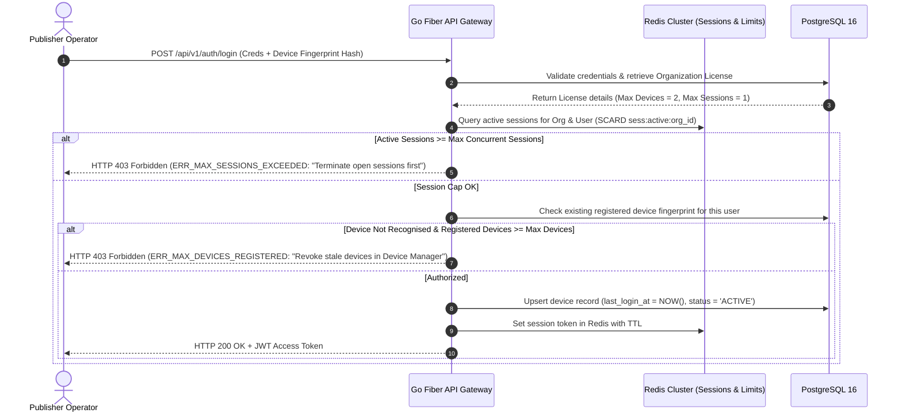

# Phase 2 Volume 1: Governance, Licensing, Team RBAC & White-Label Architecture

**Project:** Newspaper Automatic Composition SaaS Platform (Phase 2 — Publisher Experience)  
**Target Audience:** Enterprise Solutions Architects, DevOps Leads, Fintech & SaaS Billing Engineers  
**Modules Covered:** Module 1 (License Management), Module 2 (Device Management), Module 3 (Team Management & RBAC), Module 20 (Admin Improvements), Module 22 (Pricing Engine), Module 23 (Feature Flags), Module 24 (White-Label Ready)

---

## 1. Non-Breaking Architectural Evolution Mandate
Phase 2 strictly adheres to an **Additive-Only Protocol**. Existing Phase 1 APIs (`/api/v1/newspapers/generate`, `/api/v1/wallet/balance`) and database tables (`organizations`, `users`, `wallets`, `generation_history`) remain completely untouched in structure and execution logic. All Phase 2 capabilities are layered transparently via middleware hooks, event-driven Redis triggers, and foreign-key relational extensions.

---

## 2. License Management Engine (Module 1)

Every publisher organization is governed by a cryptographic License Key that controls publication quotas, storage allocations, and concurrency limits without disrupting the existing Razorpay Wallet accounting layer.

### 2.1 Cryptographic License Structure & Entitlements
A valid license record defines strict operational boundaries:
* **License Key Format:** Cryptographically signed alphanumeric token (`NP-ENT-2026-XXXX-XXXX-XXXX`).
* **Tier Entitlements & Limits Table:**

| License Tier | Max Devices | Max Concurrent Sessions | Monthly Generation Limit | Cloud Storage Limit | White-Label Rights | Auto-Renewal Support |
| :--- | :---: | :---: | :---: | :---: | :---: | :---: |
| **Basic** | 2 | 1 | 30 Issues (Daily) | 20 GB (Cloudflare R2) | 🔴 No | 🟢 Supported via Wallet |
| **Pro** | 10 | 5 | 150 Issues | 100 GB | 🔴 No | 🟢 Supported via Wallet |
| **Enterprise** | 50 | 25 | **Unlimited (9,999)** | 1,000 GB (1 TB) | 🟢 Yes (Custom Domain) | 🟢 Supported via Wallet |

### 2.2 License vs. Wallet Hybrid Pricing Architecture (Module 22)
To provide flexibility across disparate newspaper publishing models, our backend pricing engine evaluates usage under three distinct billing modes:
1. **Pure Wallet Deduction (Phase 1 Default):** No recurring monthly subscription fee; ₹100 deducted from the ledger per generated PDF.
2. **Pure License Subscription:** Monthly flat fee paid upfront; generation API calls cost ₹0 against the wallet ledger as long as the organization is within its `monthly_generation_limit`.
3. **Hybrid Pricing Model (Default for Phase 2):** Publisher holds a base monthly license tier (e.g., Basic = 30 Issues/mo). When issue #31 is initiated, rather than blocking production during critical editorial deadlines, the engine outputs an interactive UI modal offering to consume ₹100 from the active wallet balance for each supplementary overdraft edition.

---

## 3. Device & Session Security Management (Module 2)

To prevent credential sharing and enforce license device restrictions across regional bureaus, every login event creates an isolated device session tracking record.

### 3.1 Device Fingerprinting & Geolocation Intelligence
When an operator authenticates via `/api/v1/auth/login`, our Go Fiber gateway parses:
* **User Agent Syntax:** Resolves operating system (Windows 11, macOS, Android Tablet) and web browser (Chrome, Safari, Firefox).
* **Network & GEO Topology:** Extracts real IP address via Nginx `X-Forwarded-For`, mapping country, city, and timezone via low-latency in-memory MaxMind GeoLite2 indexing.
* **Hardware Fingerprint:** Frontend computes a SHA-256 canvas and browser characteristics hash (`device_fingerprint`), binding the refresh token session to that exact hardware device.



---

## 4. Team Management & Granular RBAC Architecture (Module 3)

In Phase 1, each newspaper was managed by a generalized user account. In Phase 2, a publishing enterprise represents a unified collaborative newsroom with segmented role responsibilities.

### 4.1 Enterprise Newsroom Hierarchy (8 Granular Roles)
We expand our RBAC matrix to cover specialized newspaper staff:
1. **Owner:** Supreme authority for the publication organization. Manages license upgrades, billing wallets, and invites top-level editors.
2. **Publisher / Editor-In-Chief:** Controls default publishing settings, approves newspaper editions, and holds override power over issue numbers (Ank).
3. **Sub Editor / Bureau Chief:** Creates specific sub-editions (e.g., City Edition vs. District Edition) and approves article layouts within their desk.
4. **Designer / Layout Artist:** Operates the Template Manager, configures CMYK bleed margins, and initiates test composition proofs without publishing rights.
5. **Reporter / Correspondent:** Uploads regional photographs and press announcements directly into designated folders within the Cloud Asset Library.
6. **Accountant:** Specialized finance auditor. Accesses wallet transaction histories, Razorpay invoices, and pricing logs; explicitly restricted from newspaper generation tools.
7. **Viewer / Press Operator:** Read-only production worker stationed at the commercial printing press; authorized solely to download finalized 300-DPI CMYK PDF editions.
8. **Admin / System Operator:** Internal SaaS platform employee providing technical support and monitoring system telemetry.

---

## 5. White-Label & Custom Domain Architecture (Module 24)

Enterprise tier publishers require custom white-label portals (e.g., `publish.dainik-bhaskar.com`) complete with custom brand themes, logos, and transactional email sender identities without requiring dedicated application instances.

### 5.1 Zero-Code Edge Multi-Tenancy Resolution
Our compiled Go Fiber backend serves thousands of custom domain tenants simultaneously through intelligent edge `Host` header inspection:

```mermaid
graph TD
    UI1[publish.tenant-alpha.com] -->|HTTPS CNAME| CF[Cloudflare Anycast SSL for SaaS]
    UI2[portal.tenant-beta.in] -->|HTTPS CNAME| CF
    UI3[portal.newspaper-erp.com] -->|Default Platform Domain| CF

    CF -->|Pass Original Host Header| NGINX[Nginx Reverse Proxy]
    NGINX -->|Forward Request| GF[Go Fiber API Server]
    
    GF -->|Middleware: Parse Host Header| CACHE{Look Up Host in Redis Cache}
    CACHE -->|Hit (Sub-millisecond)| INJECT[Inject Tenant Branding into Fiber Context & State]
    CACHE -->|Miss| DB[Query white_label_configs table in PG]
    DB -->|Store in Redis 24h TTL| INJECT
    
    INJECT -->|Return JSON & Theme CSS Variables| NEXT[Next.js App Router Dynamically Renders Brand Logo, Colors & Typography]
```

---

## 6. Feature Flag Rollout Engine (Module 23)

To test AI Headline Generators and automated OCR layout algorithms safely without jeopardizing production publishing operations, we integrate a low-latency **Feature Flag Evaluation Engine**.

### 6.1 Flag Evaluation Parameters
Flags are stored in PostgreSQL and mirrored inside Redis (`ff:toggles:<key>`). When evaluating access, the system checks four hierarchical criteria:
1. **Global Toggle State:** Is the feature active across the entire SaaS cluster?
2. **Targeted Organization Inclusion:** Is the user's `organization_id` explicitly whitelisted for beta testing?
3. **License Tier Minimum:** Does the feature require a minimum tier (e.g., Pro or Enterprise)?
4. **A/B Testing Rollout Percentage:** Uses deterministic hashing of the organization ID (`hash(org_id) % 100 <= rollout_percentage`) to assign consistent canary access across a controlled subset of publishers.
