# Phase 2 Volume 2: Studio Assets, Ads, Sub-Editions, Templates & Print Settings

**Project:** Newspaper Automatic Composition SaaS Platform (Phase 2 — Publisher Experience)  
**Target Audience:** UI/UX Engineers, Frontend Architects, Prepress & Print Technology Specialists  
**Modules Covered:** Module 4 (Newspaper Editions), Module 5 (Template Manager), Module 6 (Asset Library), Module 7 (Advertisement Library), Module 8 (Print Settings)

---

## 1. Multi-Edition Newspaper Architecture (Module 4)

Major publishing syndicates manage multiple distinct geographic and temporal newspaper editions daily under a shared brand umbrella. Our architecture decouples editions while preserving strict sequential Ank number integrity.

### 1.1 Sub-Edition Taxonomy & Configuration Hierarchy
Publishing houses can generate unlimited sub-editions bound to their master organization:
* **Edition Types:** Morning Edition, Evening Bulletin, Weekend Special, District Bureau Edition, Metropolitan City Edition, Election Rapid Special, and Festival Supplement.
* **Isolated vs. Inherited Ank Numbering:** 
  - Each edition table entry includes an `inherit_parent_ank` boolean flag.
  - If set to `true`, a localized District Edition (e.g., Pune District News) prints with the exact same issue Ank number as the primary State Morning Edition (e.g., Ank #126).
  - If set to `false`, an extraordinary Evening Election Special tracks its own independent sequential issue counter, preventing sequence gaps in regular daily circulation.
* **Dedicated Branding Overrides:** Each sub-edition maintains explicit URLs for its localized masthead header, municipal sponsor logo, regional footer information block, and localized page count presets (e.g., City Edition = 24 Pages, Rural Edition = 8 Pages).

---

## 2. Reusable Studio Template Manager (Module 5)

To provide an experience comparable to Adobe InDesign and Figma, editors design and store reusable visual layouts within the Template Manager.

### 2.1 Technical Template Schema & Structural Tokens
A saved template persists as a structured JSONB payload (`permanent_settings` expansion) containing prepress geometric rules:

```json
{
  "template_name": "Standard Daily Broadsheet (12 Columns)",
  "category": "MORNING_EDITION_DEFAULT",
  "geometry": {
    "page_dimensions_mm": { "width": 350.0, "height": 546.0 },
    "margins_mm": { "top": 12.5, "bottom": 12.5, "inner": 15.0, "outer": 12.5 },
    "columns_count": 8,
    "column_gutter_mm": 4.2
  },
  "typography": {
    "primary_font_family": "Noto Serif Devanagari",
    "headline_scale_ratio": 1.25,
    "body_font_size_pt": 10.5,
    "line_height_pt": 13.2
  },
  "watermark": {
    "text": "PROOF ONLY — NOT FOR PRINT",
    "opacity": 0.15,
    "angle_degrees": -45,
    "enabled_for_drafts": true
  },
  "color_palette_hex": {
    "primary_header": "#8B0000",
    "accent_bar": "#1B365D",
    "body_text": "#1A1A1A"
  }
}
```

---

## 3. Cloud Asset & Advertisement Library (Modules 6 & 7)

A centralized cloud asset repository replaces fragmented email attachments and local desktop storage, backed by Cloudflare R2 zero-egress bucket architectures.

### 3.1 Folder Topology, QR Tools & Metadata Tagging (Module 6)
* **Hierarchical Folders:** Users structure files into virtual directory paths: `/Mastheads`, `/Sponsor_Logos`, `/Reporter_Photos`, `/QR_Codes`, and `/Advertisements`.
* **Dynamic QR Code Synthesizer:** Studio incorporates an embedded QR generator. Editors input digital web story links or advertiser coupon URLs; the backend compiles a high-resolution Vector EPS/SVG QR image directly into the asset library for placement on newspaper front pages.
* **Bulk Operation Pipeline:** Supports dragging and dropping up to 50 photos simultaneously. The browser utilizes short-lived Cloudflare R2 presigned PUT URLs, streaming uploads directly to edge storage without consuming Go API server bandwidth.

### 3.2 Advertisement Campaign Management Engine (Module 7)
Newspaper business viability depends on advertisement placements. The Advertisement Library tracks commercial campaign lifecycle metrics:

```mermaid
stateDiagram-v2
    [*] --> ACTIVE_SCHEDULED: Advertiser signs booking contract & uploads asset (e.g. 8x4 Col cm display)
    ACTIVE_SCHEDULED --> INJECTED_IN_LAYOUT: Designer places Ad UUID into today's Newspaper Edition Template
    INJECTED_IN_LAYOUT --> ACTIVE_SCHEDULED: Issue published; placement counter increments by +1
    ACTIVE_SCHEDULED --> EXPIRED: Campaign end_date reached or max impressions fulfilled
    EXPIRED --> [*]: Automated warning block displayed in Template Studio if user tries to reuse expired ad
```



* **Ad Metadata Recorded:** Client identity, booking agency contact, campaign duration dates, exact newspaper geometric column width/height requirements, pricing invoice hash, and placement priority (e.g., Front Page Solus vs. Classified Inner Section).

---

## 4. Professional Prepress & Print Settings Engine (Module 8)

Generating newspapers for commercial offset web printing presses requires adherence to international graphic typography standards that simple document converters cannot satisfy.

### 4.1 Color Spaces & Industrial Crop Mark Engineering
When a newspaper is transmitted to the external Newspaper Generator Engine, our background worker appends strict prepress execution parameters:
1. **CMYK vs. RGB Color Rendering:** 
   - **Print Production Mode:** Enforces full transformation of RGB news photographs into **Fogra39 or JapanColor2001 CMYK profile color spaces** to prevent color muddiness on high-speed newspaper print rollers.
   - **Digital ePaper Reader Mode:** Retains optimized RGB palettes with higher JPEG compression for rapid loading on consumer mobile browsers.
2. **Prepress Bleed & Crop Marks:**
   - Adds **3.0 mm exterior bleeding tolerances** outside standard page margins to accommodate mechanical paper cutting variances.
   - Embeds registration marks, color density bars (Cyan, Magenta, Yellow, Black scaling squares), and precision corner crop marks directly onto the rendered canvas edge.
3. **PDF/X-1a Compliance & DPI Resolution:**
   - Forces vector export to conform to ISO standard **PDF/X-1a:2001** (embeds all TrueType/OpenType font vectors natively within the file structure).
   - Enforces a minimum image rendering floor of **300 DPI (Dots Per Inch)** for all embedded newspaper artwork and advertisements.
