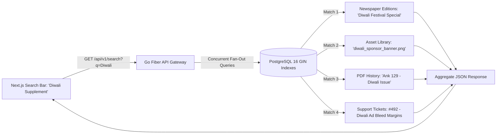

# Phase 2 Volume 4: Telemetry, BI Analytics, Search Engine & Ops Health

**Project:** Newspaper Automatic Composition SaaS Platform (Phase 2 — Publisher Experience)  
**Target Audience:** SREs, Data Engineers, Customer Success Leads, Full-Stack Developers  
**Modules Covered:** Module 13 (Activity Timeline), Module 14 (BI Analytics), Module 15 (Internal Notifications), Module 16 (Support Center), Module 17 (Global Search Engine), Module 18 (Email System), Module 19 (Auto Backup Engine), Module 21 (System Health)

---

## 1. Chronological Activity Timeline & Universal Search (Modules 13 & 17)

### 1.1 Chronological Activity Audit Timeline (Module 13)
Every significant state mutation within a newspaper publishing enterprise is appended to a unified chronological timeline, giving newsroom editors and owners transparent visibility into daily operations:
* **Events Recorded:** Profile update, Razorpay wallet recharge, invoice creation, PDF generated, masthead header swapped, password changed, device session revoked, and license upgraded.
* **Filter & Search Capacities:** The user interface features an interactive timeline dropdown filterable by actor (`Editor vs Designer`), date windows, and module category.

### 1.2 Universal Global Search Engine (Module 17)
To navigate vast repositories of articles, advertisements, and financial logs instantaneously, we implement an integrated **PostgreSQL Trigram & GIN Full-Text Search Engine**:

---

## 2. Business Intelligence Analytics & Telemetry (Module 14 & 21)

### 2.1 Publisher BI Dashboard (Module 14)
The upgraded publisher console introduces interactive Recharts visualization modules tracking historical operational efficiency:
* **Wallet Usage & Burn Rate:** Daily financial expenditure curves (INR ₹ vs. number of issues generated).
* **Throughput & Speed Telemetry:** Tracks mean worker generation velocity (e.g., `"Average layout rendering time: 24.2 seconds"`).
* **Storage Allocation Trends:** Real-time capacity gauge tracking consumed gigabytes against the organization's Cloudflare R2 License cap.

### 2.2 Live System Health DevOps Console (Module 21)
Super Admins receive a real-time command cockpit monitoring microservice infrastructure performance:

| Telemetry Component | Metric Captured | Warning Alert Threshold | Critical Action Trigger |
| :--- | :--- | :--- | :--- |
| **CPU & Memory Sandbox** | Host VPS Core Load & RAM Saturation | > 75% Sustained Load | Auto-scale worker swarm containers |
| **PostgreSQL DB** | Active Connections & Slow Query Latency | > 80 Active Conns / > 500ms | Kill idle transactional locks |
| **Redis Cache Cluster** | Memory Eviction & Pub/Sub Queue Length | > 1,000 unhandled Asynq jobs | Trigger priority queue alerting |
| **External Generator API** | Engine HTTP Response Status & Timeout Ratio| > 2% HTTP 500 / 504 errors | Initiate automated wallet auto-refunds |

---

## 3. Internal Notification Center & Support Ticketing (Modules 15 & 16)

### 3.1 Real-Time Notification Engine (Module 15)
An interactive notification dropdown menu operates directly within the Next.js navigation masthead:
* **Alert Classifications:** Wallet Balance Below Minimum Threshold (₹500), Newspaper Composition Complete, License Expiration Warning (7 Days remain), Scheduled Database Maintenance, and Broadcast Admin Announcements.
* **State Operations:** Users can execute one-click operations: **Mark All Read**, **Filter Unread**, or **Archive Notifications**.

### 3.2 Enterprise Support Ticket Center (Module 16)
Provides direct technical support ticketing directly inside the portal without relying on external third-party help desks:
* **Ticket Fields:** Ticket Title, Priority Level (`Low`, `Medium`, `Urgent - Press Deadline Stopped`), Category (`Prepress CMYK`, `Billing Ledger`, `License Sync`), Status (`Open`, `Under Investigation`, `Resolved`), and Cloudflare R2 file attachments (e.g., sample corrupted layout proofs).

---

## 4. Email Engine & Auto-Backup System (Modules 18 & 19)

### 4.1 Responsive Transactional Email System via Resend (Module 18)
All programmatic email communications employ modern, mobile-responsive HTML templates formulated to reinforce trust and professional design:
* **Templates Included:** Razorpay Payment Success Receipt (with embedded GST Tax Breakdown Table), PDF Publication Completion Notification (with direct secure presigned download link), License Expiry Notice, and Support Ticket Resolution Alert.

### 4.2 Automated R2 Archival Backup Engine (Module 19)
To fulfill disaster recovery promises without human intervention, an automated cron container executes scheduled backup sequences:
1. **Daily Backup Execution (01:00 AM IST):** Generates a fully encrypted PostgreSQL schema dump and compresses all new asset logos and headers into an archival bundle.
2. **Cloudflare R2 Immutable Storage:** Uploads the encrypted bundle to an offline bucket (`/offline-backups/2026-08/backup-20260803.enc`).
3. **Automated Retention Policy:** Automatically purges backup bundles older than 30 days while preserving exact quarterly audit snapshots permanently.
