# Phase 2 Volume 5: Non-Breaking Database Schema & ER Diagram

**Project:** Newspaper Automatic Composition SaaS Platform (Phase 2 — Publisher Experience)  
**Target Audience:** Lead Database Architects, SQL Development Teams, Compliance Auditors  
**Modules Covered:** Comprehensive Relational Data Modeling across all 24 Phase 2 Additions

---

## 1. Enterprise Relational ER Diagram (Phase 1 + Phase 2 Unified)

This diagram illustrates how our **24 new Phase 2 entities** attach seamlessly to existing **Phase 1 core structures** (`organizations`, `users`, `newspapers`) via explicit foreign-key bindings without altering existing tables.

```mermaid
erDiagram
    ORGANIZATIONS ||--o| LICENSES : "governed_by_key"
    ORGANIZATIONS ||--o{ NEWSPAPER_EDITIONS : "publishes_editions"
    ORGANIZATIONS ||--o{ STUDIO_TEMPLATES : "designs_layouts"
    ORGANIZATIONS ||--o{ CLOUD_ASSETS : "stores_media"
    ORGANIZATIONS ||--o{ ADVERTISEMENTS : "manages_campaigns"
    ORGANIZATIONS ||--o| PRINT_SETTINGS : "configures_prepress"
    ORGANIZATIONS ||--o{ SUPPORT_TICKETS : "submits_inquiries"
    ORGANIZATIONS ||--o{ SYSTEM_NOTIFICATIONS : "receives_alerts"
    ORGANIZATIONS ||--o| WHITE_LABEL_CONFIGS : "brands_portal"
    USERS ||--o{ USER_DEVICES : "authenticates_via"
    USERS ||--o{ TEAM_ROLES_MAPPING : "collaborates_with"
    NEWSPAPERS ||--o{ NEWSPAPER_EDITIONS : "parent_of"
    NEWSPAPERS ||--o{ PDF_VERSIONS : "retains_draft_history"

    ORGANIZATIONS {
        UUID id PK "Phase 1 Existing Core"
        VARCHAR org_name
    }

    NEWSPAPERS {
        UUID id PK "Phase 1 Existing Core"
        INTEGER default_issue_number
    }

    LICENSES {
        UUID id PK
        UUID organization_id FK
        VARCHAR license_key UK
        ENUM tier_type "BASIC|PRO|ENTERPRISE"
        INTEGER max_devices
        INTEGER max_sessions
        INTEGER monthly_generation_limit
        BIGINT storage_limit_bytes
        BOOLEAN auto_renew_wallet
        TIMESTAMP expires_at
    }

    USER_DEVICES {
        UUID id PK
        UUID user_id FK
        VARCHAR device_fingerprint UK
        VARCHAR os_name
        VARCHAR browser
        INET ip_address
        VARCHAR city_timezone
        BOOLEAN is_revoked
        TIMESTAMP last_active_at
    }

    NEWSPAPER_EDITIONS {
        UUID id PK
        UUID newspaper_id FK
        VARCHAR edition_name "Morning / Evening / City"
        BOOLEAN inherit_parent_ank
        INTEGER custom_ank_counter
        TEXT custom_header_url
        TEXT custom_logo_url
        INTEGER default_page_count
    }

    STUDIO_TEMPLATES {
        UUID id PK
        UUID organization_id FK
        VARCHAR template_name
        JSONB geometry_rules "Margins / Columns / Bleeds"
        JSONB typography_rules "Fonts / Line height"
        JSONB watermark_config
    }

    CLOUD_ASSETS {
        UUID id PK
        UUID organization_id FK
        VARCHAR folder_path "e.g. /Mastheads /QR_Codes"
        VARCHAR file_name
        TEXT r2_object_url
        BIGINT file_size_bytes
        TEXT[] tags
    }

    ADVERTISEMENTS {
        UUID id PK
        UUID organization_id FK
        VARCHAR client_name
        VARCHAR campaign_title
        VARCHAR geometric_size "e.g. 8x4 Col cm"
        INTEGER placement_count
        DATE start_date
        DATE expiry_date
        ENUM status "ACTIVE|EXPIRED|ARCHIVED"
    }

    PRINT_SETTINGS {
        UUID id PK
        UUID organization_id FK
        ENUM color_space "CMYK_FOGRA39|RGB_WEB"
        DECIMAL bleed_margin_mm "Default 3.0mm"
        BOOLEAN render_crop_marks
        VARCHAR pdf_standard "PDF/X-1a"
        INTEGER target_dpi "Min 300 DPI"
    }

    PDF_VERSIONS {
        UUID id PK
        UUID generation_history_id FK
        UUID newspaper_id FK
        INTEGER issue_number
        INTEGER version_sequence "v1, v2, v3..."
        TEXT r2_pdf_url
        BOOLEAN is_active_master
        TIMESTAMP created_at
    }

    WHITE_LABEL_CONFIGS {
        UUID id PK
        UUID organization_id FK
        VARCHAR custom_domain UK "publish.tenant.com"
        TEXT brand_logo_url
        VARCHAR primary_theme_color "#4F46E5"
        VARCHAR custom_smtp_sender
    }
```

---

## 2. Zero-Breaking Additive Migration Plan

### 2.1 Schema Deployment Protocol
The Phase 2 database upgrade is deployed via an atomic migration file (`00002_phase2_publisher_platform.sql`). Because zero alterations are performed against Phase 1 tables, **downtime required for this migration is strictly 0 seconds**:
1. All new ENUM types (`license_tier`, `edition_type`, `ticket_priority`, `color_space`) are explicitly created using `DO $$ BEGIN ... EXCEPTION ... END $$;` idempotency checks.
2. New Phase 2 tables construct foreign keys referencing `organizations(id)` with `ON DELETE CASCADE` or `RESTRICT` governance rules.
3. Rapid GIN text and trigram indexing (`pg_trgm`) is applied across `cloud_assets(file_name, tags)` and `advertisements(client_name, campaign_title)` to support Module 17 global search speeds without blocking ongoing newspaper printing transactions.
