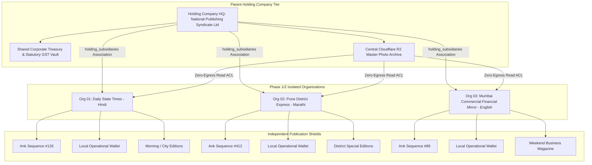
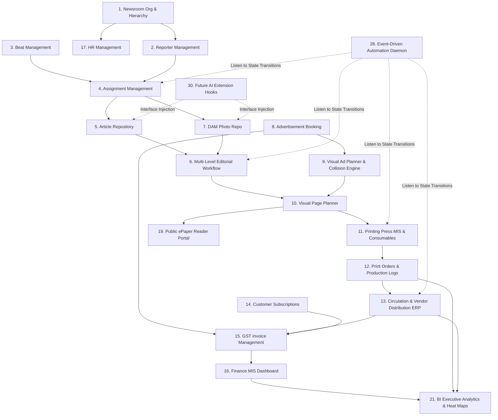

# Phase 3 Volume 1: ERP System Architecture, Multi-Company Syndicates & Module Dependencies

**Project:** Newspaper Automatic Composition Enterprise ERP Platform (Phase 3)  
**Target Audience:** Chief Technology Officers, ERP Architects, Enterprise Media Group Directors  
**Modules Covered:** Module 1 (Newsroom Organization), Module 24 (Multi-Company Support), Module 25 (Enterprise API), Module 29 (System Settings), Module 30 (Future AI Ready)  
**Deliverables Answered:** #1 (ERP System Architecture), #6 (Module Dependency Diagram), #18 (Security & RBAC Updates), #20 (Monitoring & Logging)

---

## 1. Enterprise ERP Architectural Synthesis & Zero-Breaking Mandate
Phase 3 upgrades our publishing portal into a high-throughput **Newspaper Enterprise Resource Planning (ERP) Suite**. The core architectural invariant remains absolute: **Zero Breaking Changes to Phase 1 & Phase 2 structures**. All existing Go Fiber authentication pipelines, Razorpay wallet deduction ledgers, Asynq generation workers, and Cloudflare R2 presigned storage buckets are natively ingested into the wider ERP operational matrix.

---

## 2. Multi-Company Holding Syndicate Architecture (Module 24)

Large-scale national media syndicates govern hundreds of publishing imprints (e.g., *Times Group* owning *Economic Times*, *Mumbai Times*, and 50 regional district papers). To accommodate holding structures without altering Phase 1 `organizations` tables, we implement an **Associative Holding Matrix**:



* **Shared vs. Isolated Entities:**
  - **Shared Resources:** Corporate finance ledger overviews, employee HR document repositories, global advertising rate cards, and centralized DAM photo collections.
  - **Strictly Isolated Entities:** Individual newspaper issue Ank numbers, local Razorpay operational top-up wallets, physical printing machine shift logs, and localized sub-editions.

---

## 3. Newsroom Organization & Unlimited Hierarchy (Module 1)

To model intricate journalistic hierarchies across international bureaus, we establish a recursive tree topology within the `newsroom_org_units` and `employee_hierarchies` database tables:
* **Unlimited Recursive Levels:** Organization $\to$ Head Office $\to$ Regional Directorate $\to$ District Bureau $\to$ City Desk $\to$ Chief Editor $\to$ News Editor $\to$ Sub Editor $\to$ Senior Reporter $\to$ Staff Correspondent $\to$ Freelance Contributor $\to$ Field Photographer.
* **Materialized Path Indexing (L tree equivalents):** To execute instant organizational chart tree visualizers without deep N+1 SQL joins, each unit retains a dot-delimited path index (e.g., `/org_hq00/region_west/bureau_pune/desk_crime`).

---

## 4. Comprehensive ERP Module Dependency Diagram (Deliverable #6)

This diagram clarifies the downstream data flow and operational dependencies running across all 30 Phase 3 modules:



---

## 5. Enterprise API, Webhooks & System Settings (Modules 25 & 29)

### 5.1 REST APIs, Webhook Subscription Registry & Rate Limiting (Module 25)
* **Webhook Subscription Vault:** Publishers can register HTTP endpoint callbacks in `api_webhook_targets`. When ERP state changes occur (e.g., `event.print_order_completed` or `event.ad_invoice_paid`), background Asynq workers sign the JSON payload with HMAC-SHA256 and deliver retry-backed webhook notifications to external enterprise CRM or payroll software.
* **Dedicated API Key Management:** Generates revocable access tokens (`np_live_xxxx...`) equipped with granular permission scopes and Redis sliding-window token bucket limits (`100 req/min per key`).

### 5.2 Master System Settings & Statutory Defaults (Module 29)
The central configuration dashboard manages corporate ERP parameters:
* **Statutory Tax Rules:** Default Indian GST tax tiers (e.g., 5% print media advertising, 18% digital commercial services) and TDS withholding deduction coefficients.
* **Operational Defaults:** Standard prepress paper trim margins, warehouse paper reel basis weights (GSM), ink consumption forecasting coefficients, and working hour schedules.

---

## 6. Future AI Ready Architecture & Extension Hooks (Module 30)

To guarantee our codebase remains future-proof without risking immediate runtime instability or unnecessary LLM API cost consumption, we implement **Decoupled Strategic Interface Extensions** within `/backend/pkg/ai/extension_hooks.go`:

```go
package ai
// Clean interfaces allowing seamless future LLM injection without rewriting core Go Fiber controllers

type EditorialAIExtension interface {
    SuggestHeadlines(bodyText string, language string) ([]string, error)
    TranslateArticle(content string, targetLang string) (string, error)
    VerifyFactCheck(claims []string) ([]FactCheckResult, error)
}

type DAMPhotoAIExtension interface {
    GenerateExifTags(r2ImageURL string) ([]string, error)
    PerformOCRTextExtraction(r2ImageURL string) (string, error)
}
```
Currently, active dependency injection wires lightweight pass-through dummy providers into these interfaces. When custom Devanagari OCR or LLM translation models are deployed in future iterations, zero edits to our database or API layer will be required.
