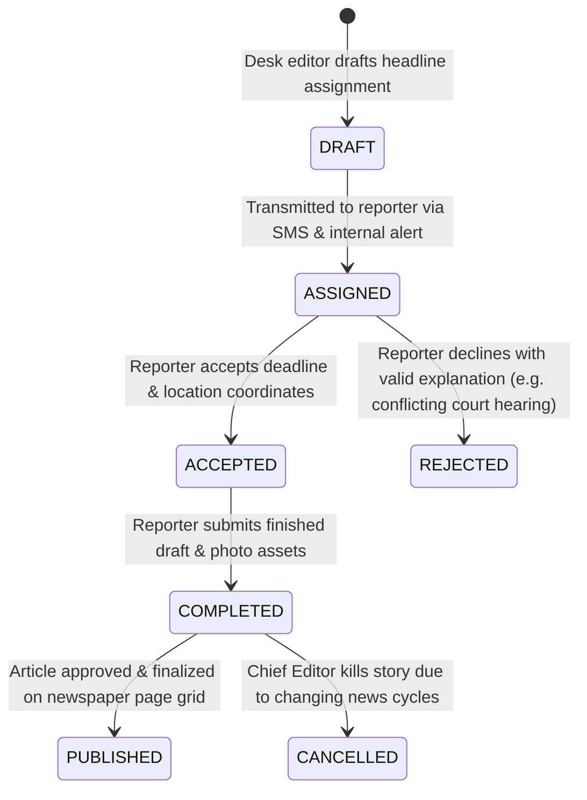

# Phase 3 Volume 2: Newsroom Editorial CMS, DAM & Approval Workflows

**Project:** Newspaper Automatic Composition Enterprise ERP Platform (Phase 3)  
**Target Audience:** Chief Editors, Managing Editors, Newsroom Directors, Frontend Systems Leads  
**Modules Covered:** Module 2 (Reporter Management), Module 3 (Beat Management), Module 4 (Assignment Management), Module 5 (Article Repository), Module 6 (Editorial Workflow), Module 7 (Photo DAM), Module 18 (Calendar)  
**Deliverables Answered:** #7 (Editorial Workflow Diagram), #12 (UI Wireframes for Editorial Suite)

---

## 1. Reporter & Beat Management Engine (Modules 2 & 3)

### 1.1 Reporter Profiles & Performance Intelligence (Module 2)
Every active newsroom correspondent operates an isolated reporter profile bound to our user hierarchy:
* **Recorded Parameters:** Employee ID, headshot URL, official editorial department (`National Desk`, `Crime & Legal`, `Investigative`), primary bureau assignment, emergency contact details, and joining date.
* **Real-Time Performance Telemetry:** The ERP aggregates daily activity metrics into a dynamic score:
  $$\text{Performance Score} = (\text{Articles Published} \times 10) + (\text{Front Page Bylines} \times 25) - (\text{Deadline Overdues} \times 15)$$

### 1.2 Multi-Beat Assignment Topology (Module 3)
Reporters are assigned to specialized journalistic beats via many-to-many relationship mappings (`reporter_beat_mappings`):
* **Standardized Beats:** Politics, Crime, Education, Sports, Business, Agriculture, Health, Entertainment, Technology, Weather, and Election Rapid Tracking.
* **Custom Beat Creator:** Newsroom directors can synthesize customized beats (e.g., `Union Budget 2026 Special` or `Kumbh Mela Pilgrimage Desk`) directly from the UI without database schema alterations.

---

## 2. Assignment Workflow & Article Repository (Modules 4 & 5)

### 2.1 Editorial Assignment Engine (Module 4)
Editors issue journalistic assignments directly to reporters in the field:



### 2.2 Complete Article Repository & Versioning (Module 5)
When reporters submit completed drafts, the article resides within a version-controlled repository:
* **Metadata Fields:** Primary headline, secondary subheadline, multi-paragraph body copy text, target language (`Hindi / Devanagari Script`), SEO tags, regional district keywords, and linked DAM photography attachments.
* **Immutable Diff Tracking:** Every editorial modification (e.g., Sub-Editor correcting syntax or adjusting word count to fit column millimeter boundaries) logs a timestamped delta snapshot in `article_revisions`, allowing instant rollbacks to earlier reporter drafts.

---

## 3. 5-Stage Multi-Level Editorial Approval Workflow (Module 6 & Deliverable #7)

In commercial newspaper publishing, unverified content cannot reach the printing press. Our backend enforces a sequential **5-Stage Approval Shield**:

```mermaid
sequenceDiagram
    autonumber
    actor REP as Field Reporter / Correspondent
    actor SUB as Desk Sub Editor
    actor NWS as Senior News Editor
    actor CHIEF as Chief Editor / Managing Director
    participant ERP as Go Fiber ERP Engine
    participant PG as PostgreSQL 16
    
    REP->>ERP: POST /api/v1/erp/articles (Submit Story + DAM Photos)
    ERP->>PG: Insert article with status = 'PENDING_SUB_EDITOR'
    ERP-->>REP: Story locked for initial desk evaluation
    
    SUB->>ERP: GET /api/v1/erp/articles/inbox?role=SUB_EDITOR
    SUB->>ERP: PUT /api/v1/erp/articles/891/approve (Grammar & layout syntax verified)
    ERP->>PG: Advance status to 'PENDING_NEWS_EDITOR'; record timestamp & diffs
    
    NWS->>ERP: PUT /api/v1/erp/articles/891/approve (Journalistic accuracy & legal check passed)
    ERP->>PG: Advance status to 'PENDING_CHIEF_EDITOR'
    
    CHIEF->>ERP: PUT /api/v1/erp/articles/891/approve_publish (Assign to Front Page / Lead Story)
    ERP->>PG: Advance status to 'APPROVED_FOR_PAGE_PLANNER'
    ERP->>ERP: Emit Event: automation.article_ready_for_layout
    Note over CHIEF,ERP: Article now selectable in Module 10 Visual Page Planner Grid!
```

* **Rejection Resolution Audit:** If any supervisory editor rejects an article, they must input a mandatory `rejection_reason`. The story automatically regresses back to the reporter's personal queue (`status = 'REJECTED_NEEDS_REVISION'`) accompanied by priority system notifications and highlighted syntax diffs.

---

## 4. Professional DAM (Digital Asset Management) Photo Repository (Module 7)

A specialized Digital Asset Management (DAM) subsystem replaces generic cloud drives, structured explicitly for journalistic photo syndicates and commercial press printing:

### 4.1 Multi-Resolution Cloudflare R2 Pipeline
When a photo is ingested, background workers generate and store three strict physical resolutions inside R2 buckets:
1. **Original Prepress Master:** Lossless TIFF or RAW file saved at **300 to 600 DPI** in Fogra39 CMYK color space for direct injection into offset newspaper printing plates.
2. **Web Optimized Display Edition:** High-resolution sRGB JPEG compressed for seamless rendering on the Public ePaper website and digital readers.
3. **Studio Thumbnail:** Lightweight WebP preview icon (`200x200px`) for rapid scrolling inside the newsroom editorial dashboard.

### 4.2 Metadata & Journalistic Copyright Vault
Every DAM photo record preserves critical legal attributes:
* **EXIF & GPS Telemetry:** Automatically extracts shutter speed, lens focal length, exact latitude/longitude GPS shooting coordinates, and capturing photographer identity.
* **Copyright & Licensing Governance:** Enforces mandatory licensing classification (`In-House Staff Owned`, `Reuters / AP Wire Syndicate License`, or `One-Time Freelance Buy`), protecting the publisher against costly third-party copyright litigation.
* **Albums & Collections:** Editors organize imagery into event collections (e.g., `G20 Summit Delegation 2026` or `Monsoon Flood Disaster Coverage`), tagged with AI-ready extension metadata fields.
