# Phase 3 Volume 4: Printing Press MIS, Consumable Inventory & Production Orders

**Project:** Newspaper Automatic Composition Enterprise ERP Platform (Phase 3)  
**Target Audience:** Printing Press Directors, Production Plant Engineers, Supply Chain Controllers  
**Modules Covered:** Module 11 (Printing Press Management), Module 12 (Print Orders)  
**Deliverables Answered:** #9 (Printing Workflow Diagram), #23 (Performance & Scalability Plan for Press Load)

---

## 1. Printing Press House & Machine MIS (Module 11)

Operating a commercial high-speed newspaper web offset press requires rigorous monitoring of mechanical machine capabilities and operator labor shifts.

### 1.1 Press Machine Register & Capacity Metrics
* **Press Machine Profile:** Tracks physical printing units (e.g., *Goss Community High-Speed Offset Web*, *Manroland Cromaset 6-Tower Press*).
* **Operational Telemetry:** Records manufacturer capacity rates (e.g., `max_copies_per_hour = 65,000`), maximum color deck allowances (e.g., 4-Color CMYK on all towers vs. Monochrome Black inner pages), and current operational state (`IDLE`, `PRINTING_ACTIVE`, `MAINTENANCE_OVERHAUL`, `FAULT_TRIP`).
* **Operator Shift Log:** Binds production runs to authenticated press operator labor teams across three 8-hour daily shifts (`Morning`, `Evening`, `Graveyard Pre-Circulation`), ensuring accountability for printing quality and operational paper waste.

---

## 2. Consumable Supply Chain & Warehouse Inventory Engine (Module 11)

A newspaper printing press cannot function without continuous supplies of specialized industrial raw materials. Our ERP integrates an automated raw material inventory accounting model within `press_consumables` and `inventory_transactions`:

| Consumable Category | Measurement Unit | Reorder Threshold (Warning Alert) | Typical Consumption Rate per 10,000 Copies (12-Page Broadsheet) |
| :--- | :--- | :--- | :--- |
| **Newsprint Paper Reels** | Metric Tons (MT) & Rolls (GSM) | < 5.0 Metric Tons | ~1.35 Metric Tons (at 45 GSM standard newsprint weight) |
| **Offset Black Ink (K)** | Kilograms / Drum Liters | < 250 Kilograms | ~18.5 Kilograms |
| **Color Inks (C, M, Y)** | Kilograms / Drum Liters | < 100 kg per color | ~7.2 Kilograms per active color cylinder |
| **Aluminum Offset Plates** | Units (Thermal CTP Plates) | < 80 Units | 24 Plates per complete 12-page edition (Front + Back CMYK sets) |

* **Automated Consumable Deduction Rules:** When a Print Order concludes, production algorithms compute theoretical material usage based on printed page count and copy volume, deducting stock from warehouse inventory automatically while flagging variances against actual physical drum weight inputs.

---

## 3. Print Order Execution & Production Workflow (Module 12 & Deliverable #9)

Once the Phase 1 & 2 background Asynq workers synthesize a print-ready **PDF/X-1a 300 DPI CMYK master file** and deposit it into Cloudflare R2, the ERP initiates physical production order execution:

```mermaid
stateDiagram-v2
    [*] --> ORDER_DRAFTED: Circulation director schedules order (e.g. 60,000 copies for Morning City Edition)
    ORDER_DRAFTED --> MACHINE_ASSIGNED: Production manager allocates Tower 1 Press & Night Shift Operators
    MACHINE_ASSIGNED --> PREPRESS_CTP_READY: Press operators download R2 CMYK master & burn 24 thermal aluminum plates
    PREPRESS_CTP_READY --> RUNNING_ACTIVE: Press high-speed web rollers start; ink & paper reels engaged
    RUNNING_ACTIVE --> PAUSED_FAULT: Automated sensor or operator halts run (e.g. paper web web break or ink bleed)
    PAUSED_FAULT --> RUNNING_ACTIVE: Operators rethread paper roll and clear machine fault
    RUNNING_ACTIVE --> COMPLETED_VERIFIED: 60,000 copies achieved; final counter logs verified
    COMPLETED_VERIFIED --> [*]: Waste copies calculated & stock inventory deduced; released to Distribution ERP!
```

### 3.1 Waste Copy Reconciliation & Audit Balance
High-speed newspaper web printing presses generate unusable "spoilage or start-up waste copies" while reaching optimum rolling speeds and ink density registration balances. The Print Order log enforces strict waste reporting:
$$\text{Net Billable Circulation Count} = \text{Total Machine Sensor Output Count} - \text{Defective Start-Up Waste Copies}$$
* **Waste Threshold Governance:** If an operator shift logs waste exceeding **2.5% of total production copy volume**, an automatic investigatory compliance alert fires in the DevOps System Health & Finance dashboard to audit potential paper reel defects or machine calibration failures.
