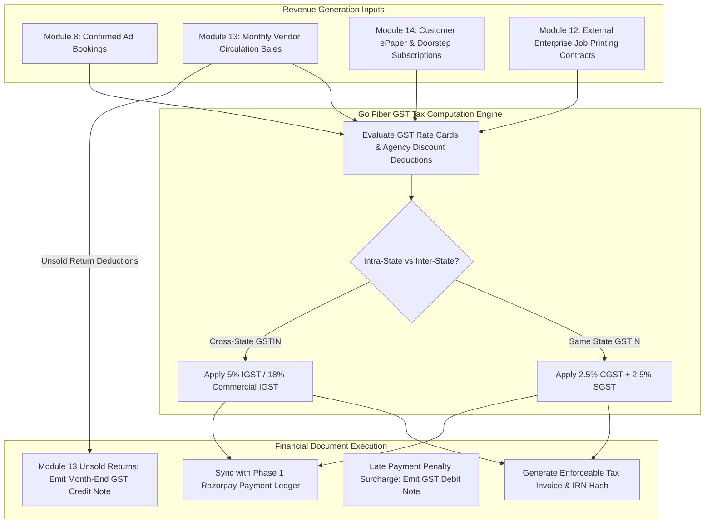

# Phase 3 Volume 6: Enterprise Finance GST Invoicing, HR MIS, BI & Compliance Vaults

**Project:** Newspaper Automatic Composition Enterprise ERP Platform (Phase 3)  
**Target Audience:** Chief Financial Officers (CFOs), HR Directors, Statutory Compliance Auditors, BI Analysts  
**Modules Covered:** Module 15 (Invoice Management), Module 16 (Finance Dashboard), Module 17 (HR Management), Module 21 (Business Intelligence), Module 22 (Document Management), Module 23 (Compliance)  
**Deliverables Answered:** #11 (Finance Workflow Diagram), #21 (Backup & Disaster Recovery Updates for Compliance Vaults)

---

## 1. Enterprise Finance & Statutory GST Invoicing (Modules 15 & 16)

A commercial newspaper organization manages complex revenue streams across advertising agency credit billing, direct circulation vendor sales, and corporate job printing contracts.

### 1.1 GST Invoice, Credit & Debit Note Engine (Module 15)
Every billing transaction within `erp_invoices` strictly adheres to statutory Indian GST electronic invoicing (e-Invoice & IRN hash) compliance:

### 1.2 Executive Finance MIS Dashboard (Module 16 & Deliverable #11)
The Finance command deck synthesizes general accounting ledgers into real-time profitability analytics:
* **Profitability Balance Sheet:** Tracks gross operating revenue against manufacturing costs (paper reel consumption, offset ink expenditures, press machine electricity overhead, and staff salaries).
* **Outstanding Debtors Aging MIS:** Categorizes unpaid advertising invoices by delinquency brackets (`0-30 Days`, `31-60 Days`, `60+ Days Overdue`), firing automated credit holds on agencies exceeding authorized credit limits.

---

## 2. HR Management & Employee MIS (Module 17)

Managing hundreds of newsroom correspondents, desk editors, and machine technicians requires specialized media workforce tracking within `hr_employees`:
* **Attendance & Shift Roster:** Monitors biometric or mobile check-in times across editorial desks and rotating press machine labor teams, calculating automated night shift differential pay bonuses.
* **Leave & Holiday Calendars:** Enforces national newspaper holiday schedules (e.g., *No-Print Press Days* following Diwali or Holi) and tracks annual sick/earned leave balances.
* **Salary Structure & TDS Withholding:** Generates monthly payroll slips (`hr_payroll_records`), automatically deducting Indian Income Tax TDS under Section 192 and depositing providential fund pensions.

---

## 3. Executive Business Intelligence & Geographic Heat Maps (Module 21)

To drive media enterprise expansion, our ERP incorporates advanced OLAP analytical modeling within the BI console:
* **Geographic Circulation Heat Maps:** Maps daily sales copy volume and digital ePaper readership concentrations across regional pin codes and administrative municipal districts.
* **Predictive Forecasting Ready:** Algorithms analyze historical circulation trajectories and advertisement seasonal trends to project upcoming monthly cash flows and raw paper reel requirements.

---

## 4. Statutory Compliance & Document Management Vaults (Modules 22 & 23)

Newspaper publishing is heavily regulated by government ministries (e.g., *Registrar of Newspapers for India - RNI*). Our ERP replaces fragmented filing cabinets with tamper-evident digital archives.

### 4.1 Digital Asset Document Management Vault (Module 22)
* **Secure Enterprise Records (`compliance_documents`):** Stores critical corporate assets inside encrypted Cloudflare R2 buckets: RNI Certificate of Registration, Municipal Press Licenses, GSTIN Tax Registrations, PAN tax identifiers, Union labor agreements, and reporter press passes.
* **Automated Expiry Warning Alerts:** Background Asynq daemons scan document expiry timestamps daily. **30 days prior to license expiration**, priority notifications trigger across the Managing Director's desktop and Slack channels to prevent publishing interruptions.

### 4.2 Statutory RNI Compliance & Disaster Recovery Audit Vaults (Module 23 & Deliverable #21)
* **Mandatory RNI Archival Retention:** Indian publishing statutory laws dictate that digital master copies of every printed newspaper issue must be preserved securely for rigorous auditing.
* **Cryptographic Digital Signature Vault:** When an issue completes rendering in Module 11, background workers append an immutable SHA-256 cryptographic hash and digital publishing timestamp to the PDF record in `compliance_documents`, certifying that editorial content has not been illegally tampered with post-publication.
* **Disaster Recovery (DRP) Upgrades:** All database financial ledgers and R2 compliance document buckets replicate daily via automated encrypted backups to offsite cold storage vaults (R2 East & West multi-region replication), assuring 100% data durability during catastrophic regional network failures.
