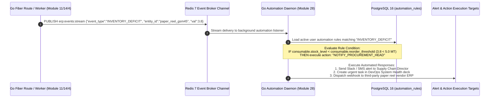

# Phase 3 Volume 7: Universal Search, Scheduled Report Engine & Automation Rules

**Project:** Newspaper Automatic Composition Enterprise ERP Platform (Phase 3)  
**Target Audience:** DevOps Engineers, Database Administrators, System Integrators, Operations Directors  
**Modules Covered:** Module 26 (Advanced Search), Module 27 (Report Engine), Module 28 (Automation Engine)  
**Deliverables Answered:** #16 (Queue & Worker Integration), #17 (Redis Strategy for Automation)

---

## 1. Global Universal Advanced Search Engine (Module 26)

In a bustling media organization, journalists, accountants, and legal advisors require sub-second discovery across tens of thousands of historical articles, ad invoices, and corporate contracts.

### 1.1 Multi-Entity GIN Trigram Search Architecture
To achieve instantaneous universal search without installing maintenance-heavy external Java search clusters (like Elasticsearch), we extend our PostgreSQL 16 **GIN Trigram (`pg_trgm`) & Full-Text Search (`tsvector`) Indexing Architecture**:
* **Indexed Target Domains:** Operates concurrently across 9 primary enterprise repositories:
  1. `articles` (Headlines, body copy, reporter bylines, district keywords)
  2. `advertisements` (Client names, agency titles, campaign themes)
  3. `generation_history` & `pdf_versions` (Historical issue Ank numbers, publication dates)
  4. `hr_employees` & `reporters` (Employee ID, phone numbers, bureau allocations)
  5. `erp_invoices` (Invoice numbers, GSTIN identifiers, debit notes)
  6. `customer_subscriptions` (Subscriber names, residential addresses, pin codes)
  7. `cloud_assets` & `dam_photos` (File names, tags, EXIF photographer captions)
  8. `assignments` (Editorial news desk instructions, location coordinates)
  9. `support_tickets` & `compliance_documents` (RNI license certificates, contract subjects)

```sql
-- Example Production GIN Multi-Entity Universal Search Routing Query
SELECT 'ARTICLE' AS entity_type, id::text, headline AS title, ts_rank(to_tsvector('simple', headline || ' ' || COALESCE(body,'')), plainto_tsquery($1)) AS relevance
FROM articles WHERE to_tsvector('simple', headline || ' ' || COALESCE(body,'')) @@ plainto_tsquery($1)
UNION ALL
SELECT 'INVOICE' AS entity_type, id::text, invoice_number AS title, 1.0 AS relevance
FROM erp_invoices WHERE invoice_number ILIKE '%' || $1 || '%' OR client_name ILIKE '%' || $1 || '%'
ORDER BY relevance DESC LIMIT 50;
```

---

## 2. Automated Scheduled Report Engine (Module 27 & Deliverable #16)

Executive corporate management mandates routine financial and operational audits delivered without human compilation delay.

### 2.1 Multi-Format Synthesis & Asynq Worker Execution
* **Supported Audit Formats:** Generates professional financial reports in three verified corporate formats:
  - **PDF Executive Dossiers:** Styled layouts complete with high-resolution chart graphics and statutory digital signatures.
  - **Excel (XLSX) Accounting Spreadsheets:** Multi-tab financial ledgers equipped with built-in macro summing formulas for audit accountants.
  - **CSV Raw Data Extracts:** Comma-separated relational table dumps for seamless ingestion into third-party payroll or GST filing software.
* **Cron-Driven Asynq Worker Schedules:** Users define automated reporting cron schedules (`scheduled_reports`). Our Phase 1 background **Asynq Worker Swarm** executes the query workloads during off-peak night hours (e.g., `0 1 * * *` for daily midnight audits), signing the exported spreadsheet and distributing presigned Cloudflare R2 download links to authorized executive email boxes via our Phase 2 Resend email engine.

---

## 3. Event-Driven Automation Engine & Alert Daemon (Module 28 & Deliverable #17)

To liberate newsroom and production managers from monitoring manual dashboards all day, we engineer an intelligent **Event-Driven Automation Engine** (`/backend/internal/services/automation_service.go`).

### 3.1 Redis Event Broker & Rule Evaluation Topology
Whenever a vital state change occurs within any Go Fiber route controller or Asynq worker, a formatted JSON event envelope is emitted onto our **Redis 7 Event Broker Channel** (`erp:events:stream`):



### 3.2 Pre-Configured Enterprise Automation Rules
Publishers can configure automated operational trigger workflows directly from the settings console without custom coding:
1. **Wallet Balance Depletion Shield:** `"IF Phase 1 organization operational wallet balance < ₹500 THEN trigger automated top-up email alert to finance director and pause non-essential draft rendering."`
2. **Advertisement Campaign Expiration Alert:** `"IF advertisement campaign expiry_date == CURRENT_DATE + 3 Days THEN emit notification to advertising sales manager to initiate customer renewal negotiation."`
3. **Editorial Assignment Overdue Alarm:** `"IF assignment status == 'ACCEPTED' AND CURRENT_TIMESTAMP > deadline_timestamp THEN dispatch urgent escalation notification to News Editor and alter dashboard row accent to Crimson."`
4. **Printing Press Machine Trip Incident:** `"IF press machine operational status transitions to 'FAULT_TRIP' during active night print run THEN sound emergency alarm in DevOps Telemetry Deck and alert Chief Production Engineer."`
