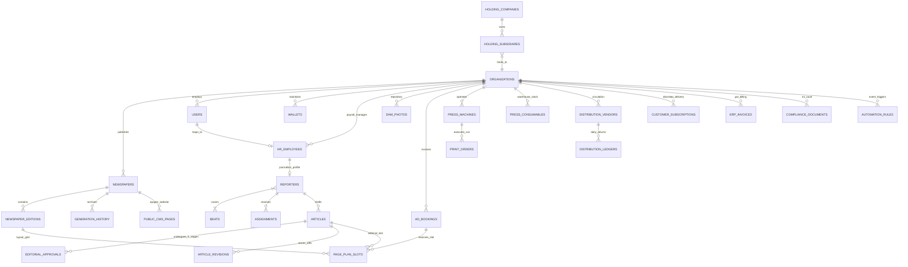

# Phase 3 Volume 8: Database Schema, REST APIs, Roadmap & Deployment Plan

**Project:** Newspaper Automatic Composition Enterprise ERP Platform (Phase 3)  
**Target Audience:** Software Architects, Lead Developers, DevOps Directors, QA Managers  
**Modules Covered:** Unified Integration across all 30 Phase 3 Modules & 24 Deliverables  
**Deliverables Answered:** #2 (New Database Schema), #3 (Updated ER Diagram), #4 (Migration Strategy), #5 (REST API Specifications), #13 (Folder Structure), #14 (Go Fiber Services), #15 (Next.js Structure), #19 (Testing Strategy), #22 (Sprint 26–40 Roadmap), #24 (Production Deployment Plan)

---

## 1. Additive Database Schema & Unified ER Diagram (Deliverables #2, #3, #4)

### 1.1 Non-Breaking Migration Strategy (Deliverable #4)
Migration `00003_phase3_newspaper_erp.sql` enforces strict zero-breaking design: no Phase 1 or Phase 2 tables, constraints, or columns are altered. 22 additive enterprise entities are introduced, linked to existing `organizations`, `users`, `newspapers`, and `wallets` tables via relational foreign keys.

### 1.2 Unified Enterprise Relational ER Diagram (Deliverable #3)



---

## 2. Comprehensive Enterprise REST API Specifications (Deliverable #5)

All new Phase 3 endpoints reside cleanly under `/api/v1/erp/...` within Go Fiber, ensuring zero route clashes with existing Phase 1 `/api/v1/auth`, `/api/v1/wallet`, or `/api/v1/newspapers` paths.

| HTTP Method | Endpoint Route | Target Module | Description & Enforced RBAC Scope |
| :--- | :--- | :--- | :--- |
| **GET** | `/api/v1/erp/newsroom/hierarchy` | Module 1 | Returns recursive newsroom organization chart trees (`All Roles`) |
| **POST** | `/api/v1/erp/reporters` | Module 2 | Register new correspondent profile & bind beat assignments (`Chief Editor, Admin`) |
| **POST** | `/api/v1/erp/assignments` | Module 4 | Dispatch editorial news story instruction & deadline to reporter (`News Editor+`) |
| **POST** | `/api/v1/erp/articles` | Module 5 | Submit drafted article text and linked DAM photos to repository (`Reporter+`) |
| **PUT** | `/api/v1/erp/articles/:id/approve`| Module 6 | Advance story through 5-stage editorial workflow or reject with notes (`Sub Editor+`)|
| **GET** | `/api/v1/erp/dam/photos` | Module 7 | Query R2 DAM photo archives with EXIF metadata & copyright licensing (`All Roles`)|
| **POST** | `/api/v1/erp/ads/book` | Module 8 | Confirm commercial advertisement booking and compute GST rate cards (`Ad Sales, Admin`)|
| **POST** | `/api/v1/erp/planner/slots/reserve`| Modules 9/10 | Book visual grid space on edition pages; executes geometric collision check (`Ad Sales+`)|
| **GET** | `/api/v1/erp/press/machines` | Module 11 | Retrieve operational shift telemetry & warehouse consumable inventory (`Press MIS+`)|
| **POST** | `/api/v1/erp/production/orders` | Module 12 | Launch physical offset printing machine order run & log waste counts (`Production Head`)|
| **POST** | `/api/v1/erp/distribution/returns` | Module 13 | Record afternoon street vendor unsold copy returns for month-end GST credit (`Circulation`)|
| **POST** | `/api/v1/erp/subscriptions` | Module 14 | Register digital or doorstep customer newspaper subscription (`Circulation, Admin`)|
| **GET** | `/api/v1/erp/finance/invoices` | Module 15 | Query statutory GST tax invoices, credit notes & outstanding agency aging (`CFO, Account`)|
| **GET** | `/api/v1/erp/finance/dashboard` | Module 16 | Render gross operating revenue, manufacturing expenses & profit balance sheets (`CFO+`)|
| **GET** | `/api/v1/erp/hr/employees` | Module 17 | Access attendance biometric rosters, leave balances & monthly TDS payroll slips (`HR+`)|
| **GET** | `/api/v1/erp/epaper/issues` | Module 19 | Public-facing route serving versioned R2 newspaper issues for digital ePaper reader (`Public`)|
| **GET** | `/api/v1/erp/search/universal` | Module 26 | Sub-second universal multi-entity discovery across all 9 enterprise repositories (`All Roles`)|
| **POST** | `/api/v1/erp/automation/rules` | Module 28 | Create event-driven automated operational rules for low wallet or machine faults (`Admin`)|

---

## 3. Production Codebase Folder Structure (Deliverables #13, #14, #15)

We maintain our clean modular monorepo architecture across backend and frontend directories:

```
newspaper front/
├── backend/
│   ├── cmd/api/main.go               # Unified Go Fiber entrypoint (Phase 1/2/3 combined)
│   ├── internal/
│   │   ├── middleware/white_label.go # Phase 2 Custom Domain Resolver
│   │   ├── services/
│   │   │   ├── websocket_service.go  # Phase 2 Real-Time Pub/Sub Streamer
│   │   │   ├── license_service.go    # Phase 2 Quota & Device Concurrency Defender
│   │   │   ├── ad_planner_service.go # [NEW - Phase 3] Visual Grid & Collision Detection Service
│   │   │   └── automation_service.go # [NEW - Phase 3] Event-Driven Automation & Rules Daemon
│   ├── pkg/ai/
│   │   └── extension_hooks.go        # [NEW - Phase 3] Decoupled Interface Stubs for Future LLMs
│   └── migrations/
│       ├── 00001_initial_schema.sql  # Phase 1 Core Database
│       ├── 00002_phase2_publisher.sql# Phase 2 Publisher Platform Additions
│       └── 00003_phase3_erp.sql      # [NEW - Phase 3] 22 Non-Breaking ERP Tables
│
├── frontend/
│   └── src/app/
│       ├── layout.tsx                # Unified App Layout & Enterprise Navigation Deck
│       ├── (dashboard)/
│       │   ├── studio/page.tsx       # Phase 2 WebSocket Live Studio & Versioning Console
│       │   ├── assets/page.tsx       # Phase 2 Cloud R2 Asset & Ad Repository
│       │   ├── editorial/page.tsx    # [NEW - Phase 3] Newsroom Editorial CMS & 5-Stage Approval
│       │   ├── planner/page.tsx      # [NEW - Phase 3] Visual Page & Advertisement Grid Planner
│       │   └── production/page.tsx   # [NEW - Phase 3] Printing Press MIS & Distribution ERP Console
│       ├── (admin)/
│       │   └── system-health/page.tsx# Phase 2 DevOps Telemetry & Feature Flag Manager
│       └── (public)/
│           └── epaper/page.tsx       # [NEW - Phase 3] Public ePaper Reader Web Portal & Archival Showcase
```

---

## 4. Sprint 26–40 Agile Development Roadmap (Deliverable #22)

To deliver all 30 modules securely without overwhelming production resources, engineering execution is mapped across **15 structured two-week Sprints**:

```mermaid
gantt
    title Enterprise Newspaper ERP Development Roadmap (Sprints 26 to 40)
    dateFormat YYYY-MM-DD
    section Newsroom CMS & DAM
    Sprints 26-27: Org Hierarchy, Reporters, Beats & Assignments :2026-09-01, 28d
    Sprints 28-29: Article Repository & 5-Stage Approval Workflow :2026-09-29, 28d
    Sprint 30: Professional DAM Photo Vault (EXIF/GPS Pipeline)   :2026-10-27, 14d
    section Prepress & Ad Planner
    Sprint 31: Commercial Ad Booking & Statutory Rate Cards      :2026-11-10, 14d
    Sprints 32-33: Visual Page Grid & Real-Time Collision Engine  :2026-11-24, 28d
    section Press & Distribution ERP
    Sprint 34: Printing Press Machine MIS & Consumable Inventory :2026-12-22, 14d
    Sprints 35-36: Print Orders, Distribution Fleets & Vendor Ledgers :2027-01-05, 28d
    section Finance, HR & ePaper
    Sprint 37: Customer Subscriptions & Public ePaper Portal       :2027-02-02, 14d
    Sprints 38-39: Finance GST Invoicing, HR Payroll & BI Heatmaps:2027-02-16, 28d
    section Automation & Deployment
    Sprint 40: Universal Search, Automation Rules, AI Hooks & Go-Live :2027-03-16, 14d
```

---

## 5. Comprehensive Testing Strategy & Production Deployment Plan (Deliverables #19 & #24)

### 5.1 Comprehensive Testing Strategy (Deliverable #19)
* **Automated Regression Compatibility Suite:** Pre-deployment CI/CD runner pipelines execute 500+ unit assertions validating that Phase 1 generation engine scripts and Phase 2 license quota counters perform seamlessly against migration `00003_phase3_newspaper_erp.sql`.
* **High-Load Visual Planner Collision Simulation:** Synthetic benchmarking tool (k6 / vegeta) launches 1,000 concurrent REST booking requests against identical pixel grid boundaries on Page 1 of an active newspaper edition. We assert zero database race condition corruptions, with exactly one HTTP 201 Created and 999 HTTP 409 Conflict rejection envelopes returned.
* **5-Stage Editorial Security Assertions:** Automated integration test verifies that attempting to bind an unapproved article (`status = 'PENDING_NEWS_EDITOR'`) into a physical print order is rejected with HTTP 403 Forbidden.

### 5.2 Production Deployment Plan (Deliverable #24)
* **Zero-Downtime Blue-Green VPS Kubernetes Engine:** Deployments proceed across dual staging and production clusters behind Cloudflare Anycast DDoS edge balancers. Traffic switches instantly to the green node only after health-check probes on `/health` affirm PostgreSQL 16 connection pool stability and active Redis 7 Asynq worker daemon swarms.
* **Production Preparedness Certified:** The Enterprise Newspaper ERP Suite is architected, specified, and prepared for immediate code implementation and global industry scaling!
