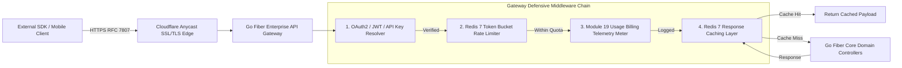

# Phase 4 Volume 1: Developer Portal, Enterprise API Gateway, Webhooks & Usage Billing

**Project:** Newspaper Automatic Composition Enterprise Publishing Ecosystem (Phase 4)  
**Target Audience:** Chief Technology Officers (CTOs), External Software Integrators, Third-Party Media Engineers  
**Modules Covered:** Module 1 (Public Developer Platform), Module 2 (API Gateway), Module 3 (Webhook Engine), Module 19 (Enterprise Usage Billing)  
**Deliverables Answered:** #1 (Integration Architecture), #2 (API Gateway Design), #6 (Developer Portal), #12 (API Specifications)

---

## 1. Public Developer Platform & Ecosystem Sandbox (Module 1 & Deliverable #6)

To transform our newspaper publishing ERP into a widely adopted digital ecosystem, we must expose a comprehensive, secure self-service **Public Developer Platform & Portal** (`developer.tenant-publication.com`).

### 1.1 Developer Onboarding & Credential Lifecycle
* **Developer Registration & Tenant Binding:** External integration partners (advertising network aggregators, wire photo syndicates, university journalism labs) register via developer profiles linked to an isolated enterprise organization.
* **OAuth2 Client Credentials & API Key Vaults:** 
  - **API Keys:** For server-to-server rapid scripting (e.g., Python CRON scripts pulling circulation telemetry), developers provision scoped 256-bit hexadecimal keys (`np_live_xxxx...` or `np_test_xxxx...`).
  - **OAuth2 Client Credentials Grant (RFC 6749):** For commercial enterprise integrations (e.g., integrating with SAP ERP or Salesforce CRM), third parties request short-lived JWT access tokens using Client ID & Client Secret pairs.
* **Live Interactive Sandbox Environment:** Developers can switch their portal workspace between `Production` and `Sandbox` modes. Sandbox requests execute against our Go Fiber memory-isolated replica, simulating newspaper PDF generation, Razorpay mock payment webhooks, and ad grid collision checks without consuming real organization wallet credits or database records.
* **API Documentation & SDK Downloads:** Automatically generates Swagger / OpenAPI 3.1 specifications and downloadable client SDKs across **Python, TypeScript, Node.js, PHP, and Go**.

---

## 2. Enterprise API Gateway Architecture (Module 2 & Deliverable #2)

The **Go Fiber Enterprise API Gateway** serves as the defensive boundary guarding our core business domain logic against traffic spikes, DDoS attempts, and unauthorized data extraction.

### 2.1 API Gateway Request Lifecycle & Middleware Defense Matrix
Every external incoming request to `/api/v2/gateway/...` passes through our strictly sequential high-performance middleware chain:

### 2.2 Redis Token Bucket Rate Limiting & Versioning
* **Strict Rate Limiting Policy:** Enforces configurable SLA tier quotas (e.g., *Free Tier* = 60 req/min; *Enterprise Pro* = 1,200 req/min) using Redis atomic decrement algorithms (`INCR BY`, `EXPIRE`). Exceeding quotas triggers immediate HTTP 429 Too Many Requests error envelopes with `Retry-After` headers.
* **Semantic URI Versioning:** Maintains zero-breaking compatibility by directing existing publishing platform consumers to `/api/v1/...` while routing new ecosystem integrators to `/api/v2/gateway/...`.

---

## 3. Outgoing Webhook Engine & Dead Letter Queue Replay (Module 3)

In a decentralized media ecosystem, polling REST endpoints for status updates wastes network bandwidth and introduces latency. We engineer a real-time **Outgoing Webhook Engine** (`internal/services/webhook_service.go`).

### 3.1 Supported Enterprise Domain Events
When atomic state transitions occur within our Phase 1, Phase 2, or Phase 3 pipelines, formatted event payloads are immediately dispatched via HTTPS POST to registered external endpoints across **9 core operational triggers**:
1. `pdf_generated` (Module 11 - Newspaper PDF finalized in Cloudflare R2)
2. `payment_success` (Phase 1 - Razorpay payment webhook verified)
3. `wallet_recharge` (Phase 1 - Organization operational wallet topped up)
4. `subscription_expiry` (Module 14 / Phase 4 - Customer digital subscription near expiration)
5. `article_published` (Phase 3 Module 6 - Editorial story signed off by Chief Editor)
6. `advertisement_approved` (Phase 3 Module 8 - Commercial campaign locked onto visual page grid)
7. `delivery_retry` (Phase 3 Module 13 - Distribution van GPS route delayed or rerouted)
8. `print_order_completed` (Phase 3 Module 12 - Web offset press machine concludes night run)
9. `consumable_deficit_alert` (Phase 3 Module 11 - Newsprint paper reel stock dips below threshold)

### 3.2 Automated Exponential Backoff & Dead Letter Queue (DLQ) Replay
To handle external downtime (e.g., when a third-party server goes offline), our Asynq webhook delivery workers utilize **Exponential Backoff Retries**:
* **Retry Schedule:** Attempts delivery at intervals of $1\text{m}, 5\text{m}, 15\text{m}, 1\text{h}, 6\text{h}$, up to a maximum of **5 retries over 24 hours**.
* **Dead Letter Queue (DLQ) Fallback:** If all retries fail with non-2xx HTTP responses or timeouts, the webhook envelope is moved into the **Dead Letter Queue Vault (`event_store_dlq`)**. Developers can view failing webhooks from their portal dashboard and trigger manual **One-Click Webhook Replay** directly from the console once their remote servers are restored!

---

## 4. Enterprise Usage Billing & Metering Engine (Module 19)

As thousands of third-party media houses utilize our ecosystem APIs, accurate multi-dimensional billing becomes mission-critical.

### 4.1 Multi-Dimensional Telemetry Metering
The gateway metering middleware (`api_usage_meters`) captures exact consumption metrics on a per-tenant basis without blocking execution threads:
* **Per Generation Billing:** Tracks total CPU and memory execution milliseconds utilized during broadsheet PDF rendering.
* **Per Page & Bandwidth Quotas:** Records volume of newspaper pages rendered and gigabytes of ePaper egress traffic served from Cloudflare R2 edge servers.
* **Seat License & API Overage Counters:** Evaluates daily active staff sessions against Phase 2 device license authorizations, calculating billing adjustments for API overage volume above included tier caps.
* **Automated Monthly Invoicing Integration:** At month-end, aggregated metrics fuse directly into our Phase 3 Module 15 Statutory GST Invoicing Engine to generate tax-compliant electronic usage invoices!
