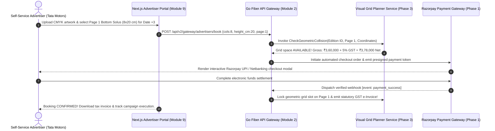

# Phase 4 Volume 2: External Stakeholder Portals & Enterprise Procurement

**Project:** Newspaper Automatic Composition Enterprise Publishing Ecosystem (Phase 4)  
**Target Audience:** Commercial Advertisers, Printing Press Operations Vendors, Raw Material Supply Chain Directors  
**Modules Covered:** Module 9 (Advertiser Portal), Module 10 (Printing Press Portal), Module 11 (Vendor Portal), Module 12 (Enterprise Procurement)  
**Deliverables Answered:** #15 (UI Wireframes for External Stakeholders), #18 (Frontend Pages Architecture)

---

## 1. Self-Service Advertiser Portal (Module 9)

In conventional newspaper advertising operations, booking a front-page ad requires days of telephone negotiations, physical artwork drops, and check clearing. Phase 4 introduces a frictionless **Self-Service Advertiser Portal** (`advertiser.tenant-publication.com`).

### 1.1 Commercial Advertiser Workflow
* **Account Dashboard & KYC Profile:** Advertising agencies or corporate brands register an advertiser identity (`advertiser_profiles`), providing their statutory GSTIN identifier and corporate office coordinates.
* **Prepress Creative Upload Engine:** Advertisers upload vector PDF/X-1a artwork or 300 DPI CMYK TIFF graphics into Cloudflare R2 prepress repositories. Our backend performs automated Preflight inspection, confirming Fogra39 color profile validity and checking for low-resolution bitmap warnings before insertion into the page layout grid.
* **Real-Time Visual Grid Reservation:** Advertisers select target dates and desired page placements (e.g., *Front Page Bottom Solus*, *Page 3 Anchor*). The portal communicates with our Phase 3 Go Fiber Ad Planner Service (`CheckGeometricCollision`), instantly verifying space availability and returning real-time pricing rate cards.
* **Online Razorpay Payment Execution:** Upon slot confirmation, advertisers complete automated electronic payment via our Phase 1 Razorpay checkout integration. Once webhook verification completes, the system emits an immutable statutory GST Tax Invoice with IRN hashes directly to the advertiser's dashboard!
* **Campaign Performance Reports:** Advertisers monitor audit reports showing physical printed circulation counts (Module 12) combined with digital ePaper ad impressions and reader engagement metrics (Module 19).



---

## 2. External Printing Press Operations Portal (Module 10)

For publishers who outsource printing to third-party regional presses, Module 10 provides a secure **Printing Press Vendor Portal** (`press.tenant-publication.com`):
* **Job Receipt & Order Acceptance:** Third-party printing contractors log in to view active print orders (`printing_vendor_jobs`). Operators review production instructions (e.g., *"50,000 Copies • 45 GSM Newsprint • 12 Pages Broadsheet"*) and click **Accept Print Job**, locking their machine schedule.
* **Prepress Master File Delivery:** Upon acceptance, operators download presigned Cloudflare R2 production master PDF/X-1a packages optimized for Computer-to-Plate (CTP) aluminum plating machines.
* **Real-Time Production Tracking & Dispatch Reports:** During overnight print runs, shift technicians update actual copy counts, report startup waste percentages, and file digital delivery van dispatch logs, ensuring synchrony between internal newsroom managers and external printing facilities.

---

## 3. Supplier Vendor Portal & Enterprise Procurement (Modules 11 & 12)

Managing raw material supply chains (Newsprint Paper Reels, Offset Black Ink Drums, Thermal Aluminum Plates) across dozens of regional printing plants requires integrated vendor interactions.

### 3.1 Raw Material Supplier Portal (Module 11)
* **Purchase Order (PO) Fulfillment:** Approved raw material vendors (e.g., paper mills, ink manufacturers) access dedicated supplier accounts (`supplier_purchase_orders`). When an order arrives, vendors acknowledge delivery timetables and log carrier tracking numbers.
* **Digital Invoice Submission:** Vendors submit electronic vendor tax invoices and proof-of-delivery delivery chits directly through the portal, initiating automated finance accounting verification in our Phase 3 Module 15 general ledgers.

### 3.2 Enterprise Procurement & Approval Workflows (Module 12)
To enforce fiscal compliance over purchasing, we implement a multi-stage **Procurement Approval Engine** (`procurement_requests`):

```mermaid
flowchart TD
    subgraph Trigger Mechanisms
        AUTO[Phase 3 Module 28 Automation Engine: Newsprint drops beneath 5.0 MT Reorder Alert Threshold]
        MANUAL[Printing Press Operations Director initiates manual Purchase Request]
    end

    subgraph Go Fiber Procurement Approval Pipeline (Module 12)
        GEN[Generate PR: Request 50 Metric Tons of 45 GSM Newsprint Reels]
        COMP[Vendor Comparison Engine: Evaluate active vendor quotation price cards & delivery lead times]
        APPR{Value exceeds ₹5,00,000?}
        CFO[Route to Chief Financial Officer for multi-signature executive sign-off]
        AUTO_APPR[Auto-Approve & emit formal statutory Purchase Order to Vendor]
    end

    subgraph Execution & Inventory Fulfillment
        PO[Dispatch confirmed PO to Supplier via Module 11 Vendor Portal]
        SHIP[Supplier delivers paper rolls to printing plant warehouse]
        INVENT[Warehouse manager verifies barcode receipt; increment stock counts in Phase 3 press_consumables!]
    end

    AUTO & MANUAL --> GEN
    GEN --> COMP
    COMP --> APPR
    APPR -->|Yes| CFO
    APPR -->|No| AUTO_APPR
    CFO -->|Approved| AUTO_APPR
    AUTO_APPR --> PO
    PO --> SHIP
    SHIP --> INVENT
```
