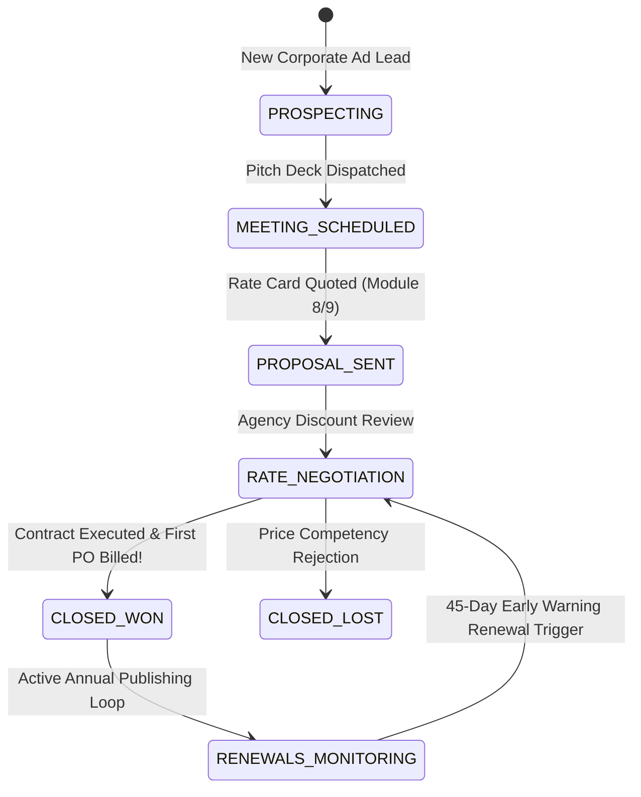

# Phase 4 Volume 3: Digital Subscriptions, Enterprise CRM & BI 2.0 Warehouse

**Project:** Newspaper Automatic Composition Enterprise Publishing Ecosystem (Phase 4)  
**Target Audience:** Chief Marketing Officers (CMOs), VP of Sales, Corporate Subscription Executives, Data Scientists  
**Modules Covered:** Module 7 (Digital Subscriptions & Coupon Engine), Module 8 (Enterprise CRM), Module 22 (Business Intelligence 2.0 KPI Warehouse)  
**Deliverables Answered:** #13 (Updated Database Schema Strategy), #14 (Migration Strategy for CRM & BI)

---

## 1. Advanced Digital Subscription Ecosystem (Module 7)

While Phase 3 Module 14 laid the foundation for individual consumer doorstep and digital subscriptions, Phase 4 expands subscription monetization to serve corporate institutions, university libraries, and family groups.

### 1.1 Flexible Billing Tiers & Group Subscription Plans
* **Supported Recurring Plan Structures (`subscription_plans`):**
  - **Individual Tiers:** Monthly prepaid, quarterly discounted, and annual unlimited digital access passes.
  - **Family Sharing Plans:** Allows a single subscribing householder to provision shared digital ePaper reading access across up to 4 family member profiles via isolated reader accounts.
  - **Institutional & Corporate Syndicates:** Enables university campus libraries, government secretariats, and business corporate offices to license multi-seat IP-range authenticated reading subscriptions, granting automatic ePaper access to hundreds of organizational employees without individual logins.

### 1.2 Promotional Coupon Engine & Viral Referral Codes
To accelerate subscriber subscriber growth and user conversion rates, we implement a robust promotion engine (`subscription_coupons`):
* **Dynamic Coupon Rules:** Marketing teams configure promo codes (e.g., `DIWALI2026`, `FREEDOM50`) supporting percentage discounts, flat INR deduction vouchers, or free trial month extensions.
* **Referral Tracking:** Every active subscriber generates an encrypted referral link. When a new customer completes registration using a referral code, our background Asynq workers credit both the referring subscriber and the new customer with ₹100 inside their Phase 1 wallet balance!

---

## 2. Enterprise Customer Relationship Management - CRM (Module 8)

Managing large advertising accounts, regional syndication contracts, and high-value media agency clients requires built-in sales team tools (`crm_customer_leads` & `crm_meeting_notes`).

### 2.1 Full-Stack Media CRM Architecture
* **Lead & Agency Pipeline Management:** Sales executives organize potential advertising clients across structured sales Kanban stages: `PROSPECTING` $\to$ `MEETING_SCHEDULED` $\to$ `PROPOSAL_SENT` $\to$ `RATE_NEGOTIATION` $\to$ `CLOSED_WON` / `CLOSED_LOST`.
* **Activity & Call Log Repository:** Records executive field sales notes, phone call transcripts, email correspondences, and calendar meetings directly linked to the client's corporate organization profile.
* **Automated Contract Renewal Alert Engine:** The CRM continuously evaluates expiring annual advertisement syndication agreements and corporate subscription plans. **45 days prior to contract expiration**, automated task alerts populate on the responsible account manager’s dashboard, ensuring proactive renewal retention!

---

## 3. Business Intelligence 2.0 KPI Data Warehouse & Forecasting (Module 22)

Executive board members at national media syndicates require forward-looking data insights that supersede simple historical accounting charts.

### 3.1 Forecasting-Ready Star Schema KPI Warehouse (`bi_kpi_warehousing`)
To isolate analytical queries from operational transactional workloads, we implement a periodic ETL (Extract, Transform, Load) Asynq data synchronization routine that populates an OLAP Star Schema warehouse table:
* **Aggregated Fact Metrics:** Compiles daily dimensional snapshots covering gross advertisement revenue, circulation copy returns, newsroom editorial output words, press consumable spoilage rates, and API developer consumption quotas.
* **Trend Analysis & Executive Command Decks:**
  - **Revenue Trends:** Visualizes month-over-month compounding growth across Print Ad Sales vs. Digital ePaper Subscription monetization.
  - **Publishing & Newsroom Velocity:** Measures reporter editorial productivity metrics (time-to-publish from initial assignment creation in Module 4 to final print sign-off in Module 6).
  - **Machine & Supply Chain Efficiency:** Evaluates press machine spoilage percentages across rotating technician shifts, highlighting production towers operating above the acceptable 1.5% waste baseline.
* **Predictive Forecasting Engine (AI Ready):** Structures historical multi-year time-series arrays in specialized JSON formats ready for ingestion by predictive regression algorithms, projecting raw paper consumption requirements and upcoming holiday festive advertisement advertising yield targets!
