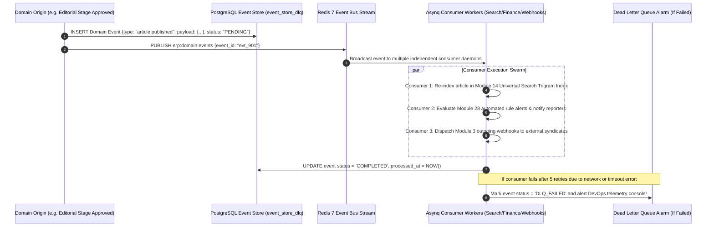

# Phase 4 Volume 4: Event Bus, Microservices, Connectors & Data Exports

**Project:** Newspaper Automatic Composition Enterprise Publishing Ecosystem (Phase 4)  
**Target Audience:** Lead System Architects, Distributed Systems Engineers, Cloud Integrators  
**Modules Covered:** Module 4 (Enterprise Connectors), Module 17 (Event Bus), Module 18 (Microservice Readiness), Module 20 (Data Export)  
**Deliverables Answered:** #3 (Event-Driven Architecture), #4 (Microservice Readiness), #17 (Backend Services), #19 (Queue Integration)

---

## 1. Ready-Made Enterprise Connectors & Integration Hooks (Module 4)

To eliminate manual file transfer friction between external corporate storage clouds and our newspaper composition pipeline, Phase 4 incorporates **Ready-Made Enterprise Connectors** (`enterprise_connectors`):
* **Cloud Object & Storage Integrations:** Out-of-the-box synchronizers for **Google Drive, Microsoft OneDrive, Dropbox, AWS S3 buckets, and Cloudflare R2**. When reporters or advertisers drop artwork into a designated shared Google Drive folder, background Asynq polling daemons fetch the file, compute SHA-256 integrity hashes, and push the asset into our Phase 2 asset repository automatically!
* **Legacy Press & Protocol Connectors:** Supports encrypted **SFTP and legacy FTP** push/pull pipelines to communicate with aging prepress image setting machinery and high-speed web offset plate developers.
* **GraphQL & REST Extensibility Ready:** Exposes GraphQL federated schemas alongside REST endpoints, allowing complex external web and mobile clients to query nested editorial articles, DAM photos, and circulation statistics within a single atomic network round trip.

---

## 2. Internal Domain Event Bus & Dead Letter Store (Module 17 & Deliverable #3)

As our codebase scales to 30 modules, direct point-to-point synchronies between domain controllers can create tight coupling and cascading failure hazards. We engineer a decoupled **Domain Event Bus & Event Store** (`internal/services/event_bus_service.go`).

### 2.1 Event-Driven Domain Topology
Every meaningful business transition occurs as an immutable domain event saved to PostgreSQL 16 (`event_store_dlq`) and broadcasted over our **Redis 7 Pub/Sub & Asynq Stream Engine**:

---

## 3. Microservice Readiness & Bounded Contexts (Module 18 & Deliverable #4)

While running as an agile, hyper-efficient **Modular Monorepo Go Fiber Gateway**, our codebase strictly separates code boundaries into autonomous **Domain-Driven Design (DDD) Bounded Contexts**, preparing the platform for instantaneous future decomposition into individual microservices:
1. **Identity & RBAC Context:** Manages user authentication, Bcrypt password hashing, organization multi-tenancy, and Phase 2 device license authorizations.
2. **Wallet & Payment Context:** Houses Phase 1 Razorpay checkout webhooks, credit balance ledgers, and usage billing transactions.
3. **Newsroom Editorial CMS Context:** Governs reporter profiles, beat assignments, articles, DAM photo vaults, and 5-stage approval workflows.
4. **Visual Advertisement Context:** Manages ad bookings, statutory rate cards, and the page grid geometric collision algorithm.
5. **Printing Press & Distribution Context:** Controls offset machine telemetry, warehouse consumables, print orders, street vendor ledgers, and ePaper generation.
6. **Analytics & Integration Context:** Drives universal search indexing, developer API keys, outgoing webhooks, CRM leads, and BI 2.0 forecasting warehouses.

---

## 4. Enterprise Scheduled Data Export Engine (Module 20)

To support audits and compliance reporting, we expand our reporting capabilities into a global **Data Export & Archiving Engine**:
* **Multi-Format Synthesis:** Users can extract multi-thousand-row tables from any module into **CSV, Excel (XLSX), PDF Dossiers, or Raw JSON arrays**.
* **Asynq Background Execution & Presigned Links:** Because exporting 100,000 historical GST invoices can take processing time, export requests return immediately with an Asynq Job ID (HTTP 202 Accepted). Background worker swarms compile the spreadsheet, gzip compress the file, upload it to Cloudflare R2, and deliver a presigned download link via real-time WebSockets and email notifications!
