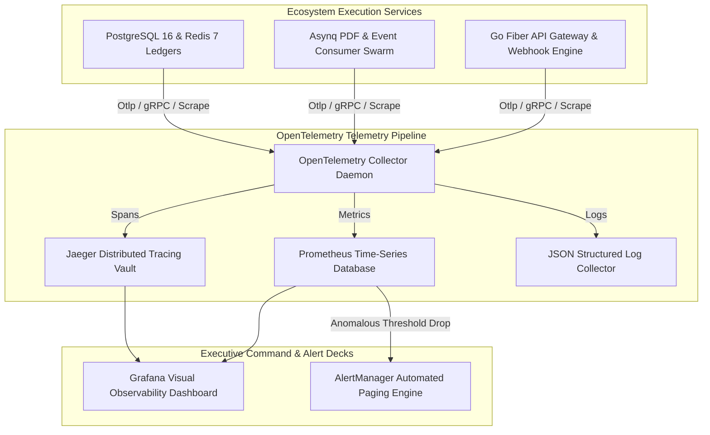

# Phase 4 Volume 7: Observability, Security Operations & Compliance

**Project:** Newspaper Automatic Composition Enterprise Publishing Ecosystem (Phase 4)  
**Target Audience:** DevOps Engineers, Chief Information Security Officers (CISOs), Regulatory Auditors  
**Modules Covered:** Module 15 (Observability), Module 26 (Security Operations), Module 27 (Compliance)  
**Deliverables Answered:** #8 (OpenTelemetry Strategy), #9 (Security Operations), #10 (Compliance Architecture), #20 (Monitoring Stack)

---

## 1. Complete OpenTelemetry Observability Stack (Module 15 & Deliverable #8, #20)

As our digital publishing ecosystem serves millions of public readers and thousands of API integrators, real-time observability is necessary to diagnose performance degradation and prevent server outages.

### 1.1 Metrics, Distributed Tracing & Logging Pipeline
We implement an **OpenTelemetry (OTel) Collector Engine** exporting multi-dimensional telemetry across three vital observability pillars:
* **Metrics (Prometheus & Grafana Command Deck):** Scrape endpoints (`/metrics`) continuously monitor Go Fiber HTTP request latency histograms, PostgreSQL 16 database connection pool saturations, Redis token bucket memory utilization, and Asynq worker queue depths.
* **Distributed Tracing (OpenTelemetry & Jaeger):** Every incoming user action or API gateway request is assigned a unique W3C Trace ID (`Trace-ID: 4bf92f3577b34da6a3ce929d0e0e4736`). This Trace ID traverses across HTTP route handlers, SQL queries, Redis Pub/Sub events, and outgoing webhooks, enabling developers to pinpoint exact millisecond bottleneck delays!
* **Structured Distributed Logging (JSON RFC 5424):** Logs emitted by all 30 modules follow strict JSON structuring, tagging errors with org identifiers and Trace IDs for instantaneous ingestion into Elastic Logstash or CloudWatch clusters.

---

## 2. Security Operations & SIEM Threat Detection Hooks (Module 26 & Deliverable #9)

To secure national publishing infrastructure against sophisticated cyber intrusions, we engineer an **Automated Security Operations & SIEM Pipeline** (`siem_audit_streams`).

### 2.1 SIEM Ready Real-Time Audit Stream Engine
* **Immutable Security Audit Log:** Every security-sensitive transaction—such as login attempts, API key generation, OAuth2 token granting, payroll slip inspection, or editorial article deletions—is logged with immutable timestamps, client IPs, user agent telemetry, and geographic pin codes.
* **Threat Detection & Anomaly Hooks:** The gateway security daemon continuously evaluates traffic patterns against heuristics:
  - **Brute Force & Credential Stuffing Defense:** Automatically blocks IP subnets exhibiting more than 10 failed authentication attempts within 5 minutes.
  - **Exfiltration Alerting:** If a single API client requests downloads for more than 50 historical newspaper PDF masters within 1 minute, an automated critical threat hook silences the API key and fires an urgent alert to the CISO’s Slack command console!

---

## 3. Statutory & Global Governance Compliance Architecture (Module 27 & Deliverable #10)

Operating a commercial media enterprise across global jurisdictions requires adherence to international privacy statutes and domestic corporate regulatory laws.

### 3.1 Certified Governance Standards Readiness Matrix
Our Phase 4 architecture natively implements the technical privacy controls needed to pass international compliance audits:
1. **ISO 27001 (Information Security Management Systems):** Enforces rigid Role-Based Access Control (RBAC) boundaries across all 30 modules, mandates TLS 1.3 encryption in transit and AES-256 GCM database storage encryption at rest.
2. **SOC 2 Type II Readiness:** Maintains verifiable cryptographic operational audit logs demonstrating continuous security monitoring, change management tracking, and disaster recovery preparedness.
3. **European GDPR (General Data Protection Regulation):** Emitted right-to-be-forgotten deletion workflows (`POST /api/v2/gateway/compliance/forget-user`). When a subscriber requests account erasure, background Asynq tasks sanitize personally identifiable information (PII) like names, phone numbers, and addresses while retaining immutable financial invoice ledger rows to satisfy fiscal tax accounting requirements.
4. **Indian Digital Personal Data Protection (DPDP) Act Readiness:** Implements explicit consent notices across all Public ePaper subscription checkout modals and customer CRM records, ensuring citizen personal data is stored inside authorized sovereign Indian data server regions (e.g., AWS Mumbai / Hyderabad)!
